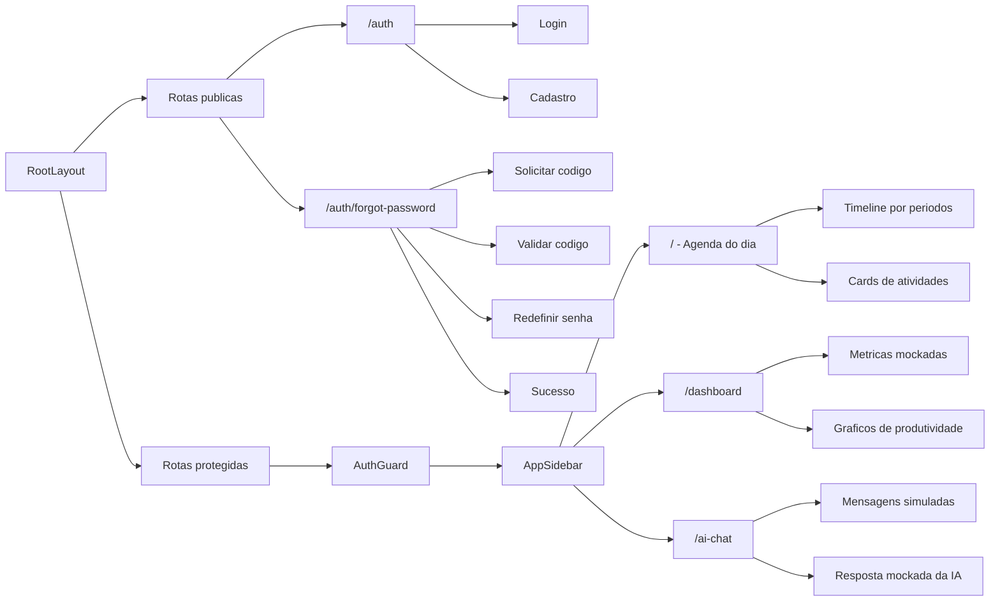
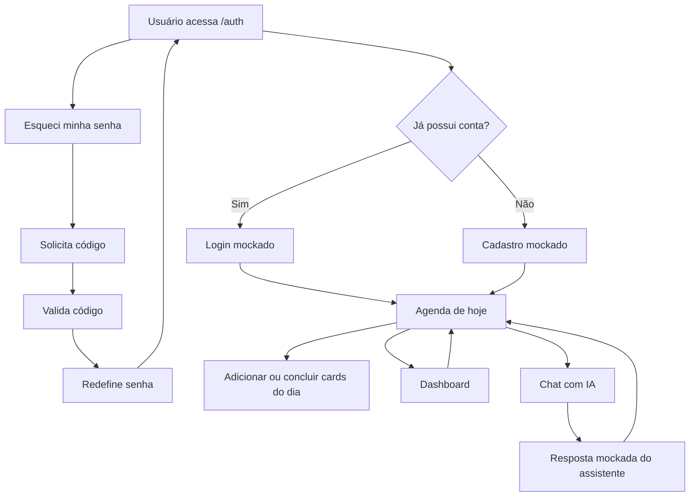
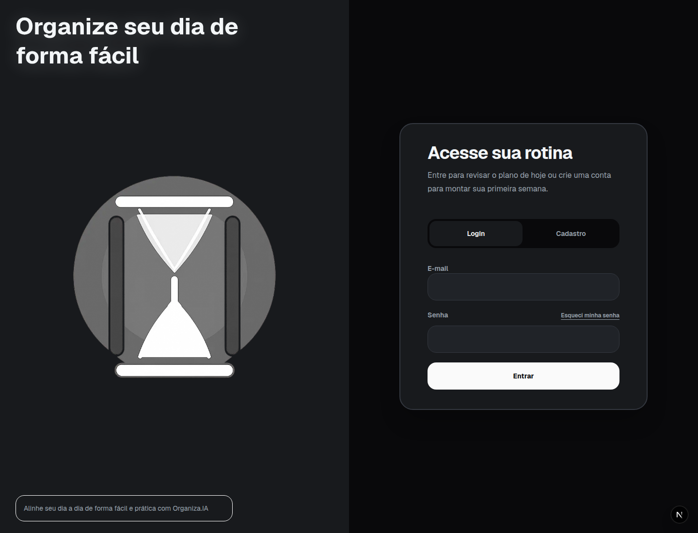
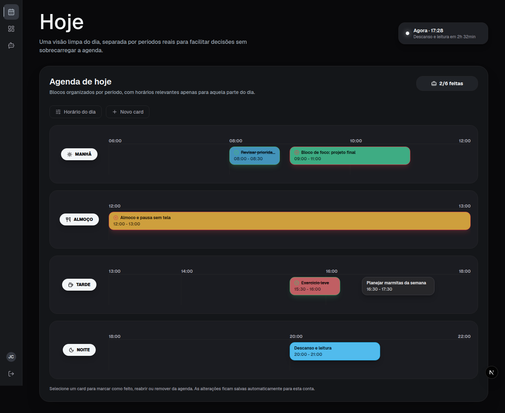
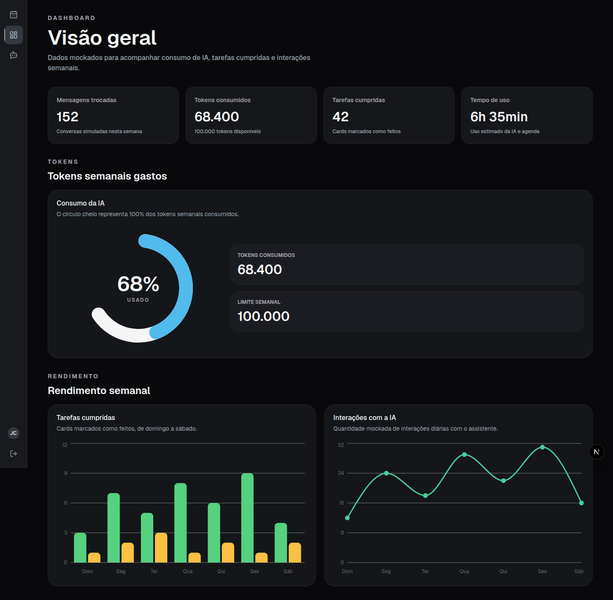
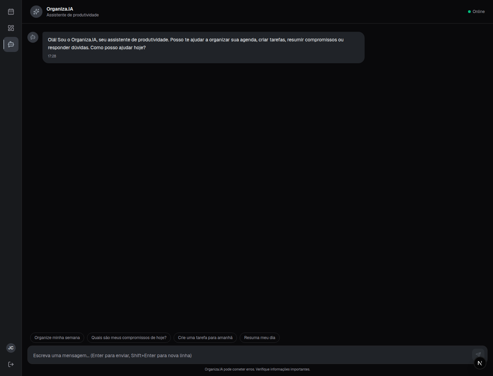

# Organiza.IA

Frontend inicial de um dashboard para interação com um agente inteligente de produtividade. O projeto foi desenvolvido como a primeira etapa do sistema final, com telas de autenticação, recuperação de senha, agenda diária, dashboard com dados mockados e uma interface inicial de chat com IA.

## Descrição do Projeto

O Organiza.IA é um gerenciador de rotina orientado por inteligência artificial. A proposta não é copiar uma agenda tradicional, que costuma listar tarefas por dia, mês e ano, mas criar uma experiência mais focada: o usuário planeja a semana com apoio da IA e acompanha, na tela principal, apenas o dia atual.

Essa escolha reduz a sobrecarga visual e ajuda o usuário a concentrar energia no que precisa ser feito hoje, evitando a ansiedade de visualizar todos os compromissos futuros ao mesmo tempo. A agenda diária funciona como uma timeline dividida por períodos reais do dia, com blocos de atividades, horários de descanso, alimentação, exercício e tarefas comuns da rotina.

O dashboard complementa essa visão com indicadores de produtividade e qualidade de vida, como tarefas concluídas, tempo de uso, interações com a IA e consumo de tokens. A ideia para a evolução do produto é limitar os assuntos tratados pela IA ao escopo de organização pessoal, evitando que ela vire uma ferramenta genérica. O consumo de tokens seria calculado pela complexidade da solicitação e pelo esforço de refatorar planos já criados: quanto maior a mudança ou quanto mais vezes um planejamento precisar ser refeito, maior será o custo estimado.

## Tema e Propósito

Tema: assistente de produtividade e organização pessoal.

Propósito: ajudar pessoas a planejarem a semana com mais clareza e executarem o dia com menos distração, usando IA como apoio para estruturar rotinas realistas.


## Escopo do Desafio

Esta entrega cobre a base visual e navegável do projeto final. A aplicação contém:

- Login com formulário funcional mockado.
- Cadastro com nome, e-mail, senha e confirmação de senha.
- Recuperação de senha em etapas.(apenas vizual)
- Agenda diária como tela principal protegida.
- Dashboard com métricas e gráficos fictícios.
- Interface inicial de chat com IA, ainda sem integração real com LLM.
- Navegação entre telas protegidas por sessão mockada.

Nesta etapa, os dados são simulados no frontend. Não há autenticação real, banco de dados real ou chamada para uma LLM externa.


## Tecnologias Utilizadas

- Next.js 16 com App Router.
- React 19.
- TypeScript.
- Tailwind CSS 4.
- shadcn/ui e Radix UI para componentes base.
- Zustand para estado global de autenticação mockada.
- Zod para validação dos formulários.
- MSW para simular endpoints de autenticação e agenda no ambiente de desenvolvimento.
- Recharts para gráficos do dashboard.
- Sonner para notificações.
- Lucide React para ícones.

## Arquitetura Frontend

O projeto usa uma organização feature-based. As rotas ficam em `src/app`, enquanto cada domínio da aplicação fica isolado em `src/features`. Componentes e utilitários reutilizáveis ficam em `src/shared`.

### Estrutura Feature-Based Atual

```text
frontend/
  public/                                  # Assets publicos servidos pelo Next.js
    images/                                # Identidade visual do Organiza.IA
    screenshots/                           # Prints das telas usados neste README

  src/
    app/                                   # Rotas, layouts e entrypoints do Next.js
      auth/                                # Area publica de autenticacao
        forgot-password/                   # Fluxo publico de recuperacao de senha
      (protected)/                         # Grupo de rotas protegidas
        dashboard/                         # Rota protegida do dashboard
        ai-chat/                           # Rota protegida do chat com IA

    features/                              # Funcionalidades isoladas por dominio
      auth/                                # Login, cadastro e sessao mockada
        api/                               # Comunicacao com a camada mockada de auth
        components/                        # Paginas, formularios e guards de autenticacao
        lib/                               # Persistencia da sessao no navegador
        mocks/                             # Simulacao dos endpoints de autenticacao
        schemas/                           # Schemas Zod de login/cadastro
        stores/                            # Store Zustand da sessao
        types/                             # Tipos de usuario e sessao
      forgot-password/                     # Fluxo de recuperacao de senha
        components/                        # Cards de solicitar, validar, redefinir e sucesso
      home/                                # Agenda diaria e timeline do usuario
        api/                               # Comunicacao com a camada mockada da agenda
        components/                        # Header, timeline, cards, dialog e formulario
        constants/                         # Horarios, tons e constantes de layout
        data/                              # Periodos e metricas iniciais mockadas
        hooks/                             # useSchedule e orquestracao da agenda
        lib/                               # Persistencia da agenda no navegador
        mocks/                             # Simulacao dos endpoints da agenda
        schemas/                           # Schemas Zod dos cards e horarios
        types/                             # Tipos da agenda
        utils/                             # Calculos de horario, posicao e ordenacao
      dashboard/                           # Indicadores e graficos de produtividade
        components/                        # Header, grid de metricas e graficos
        data/                              # Dados ficticios de tokens, tarefas e interacoes
      ai-chat/                             # Interface inicial de conversa com a IA
        components/                        # Pagina de chat e skeleton
      navigation/                          # Navegacao lateral das rotas protegidas
        components/                        # AppSidebar

    mocks/                                 # Infraestrutura global das simulacoes usadas pelas features

    lib/                                   # Espaco reservado para utilitarios globais

    shared/                                # Codigo reutilizavel entre features
      components/                          # Componentes compartilhados e base dos formularios
        ui/                                # Componentes shadcn/ui usados no projeto
      lib/                                 # Helpers e utilitarios compartilhados
      mocks/                               # Espaco reservado para mocks compartilhados
      styles/                              # Tokens de cor, tema e estilos globais
```

Use `src/features/<nome-da-feature>` para novos fluxos de produto e exponha apenas o necessário pelo `index.ts` da feature. Essa regra evita acoplamento direto entre domínios e mantém as páginas de `src/app` pequenas, focadas apenas em rota e composição.




### Decisões de Organização

`src/app`: define as rotas, layouts e páginas do Next.js. As páginas apenas importam a feature correspondente, mantendo a regra de roteamento separada da regra de interface.

`src/features/auth`: concentra login, cadastro, validações, store com Zustand, tipos e mocks de autenticação.

`src/features/forgot-password`: concentra o fluxo de recuperação de senha em etapas, separado do login para facilitar manutenção.

`src/features/home`: concentra a agenda diária, incluindo componentes da timeline, dados iniciais, hooks, validações, persistência mockada e handlers do MSW.

`src/features/dashboard`: concentra cards, gráficos e dados fictícios de produtividade, mensagens, tokens e uso semanal.

`src/features/ai-chat`: concentra a interface inicial de chat. O envio de mensagens e a resposta do assistente são simulados.

`src/features/navigation`: concentra a sidebar das rotas protegidas.

`src/shared`: reúne componentes reutilizáveis, componentes de UI baseados em shadcn/ui, função `cn` e estilos globais.

`src/mocks`: inicializa o MSW em desenvolvimento e agrega os handlers das features.

## Telas Desenvolvidas

### Login e Cadastro

A tela de autenticação apresenta um painel visual com a identidade do Organiza.IA e um formulário alternável entre login e cadastro. Os formulários usam validação com Zod, feedback visual e sessão mockada salva em `localStorage`.

### Recuperação de Senha

O fluxo de recuperação passa por solicitação de e-mail, verificação de código, redefinição de senha e tela de sucesso. A navegação é mockada para representar a experiência esperada sem depender de backend.

### Agenda do Dia

A tela principal mostra a rotina do dia em períodos como manhã, almoço, tarde e noite. O usuário pode ajustar o intervalo visível do dia, adicionar novos cards, marcar tarefas como concluídas e remover cards. As alterações são persistidas no `localStorage` durante o desenvolvimento.

### Dashboard

O dashboard apresenta métricas fictícias de produtividade e uso da IA:

- Mensagens trocadas.
- Tokens consumidos.
- Tarefas cumpridas.
- Tempo de uso.
- Gráfico de consumo semanal de tokens.
- Gráficos de tarefas concluídas e interações diárias.

### Chat com IA

A interface de chat simula uma conversa com o Organiza.IA. O usuário pode enviar mensagens, usar sugestões de prompt e visualizar uma resposta mockada. A integração real com LLM fica para uma etapa posterior.

## Fluxo do Usuário



## Prints das Telas

### Login



### Cadastro


### Recuperação de Senha


### Agenda do Dia



### Dashboard



### Chat com IA



## Como Executar Localmente

Instale as dependências:

```bash
npm install
```

Execute o ambiente de desenvolvimento:

```bash
npm run dev
```

Acesse no navegador:

```text
http://localhost:3000
```

Em desenvolvimento, o MSW é carregado automaticamente para simular os endpoints usados pela aplicação. Para entrar, crie uma conta pela tela de cadastro e use as mesmas credenciais no login. A sessão e os dados da agenda ficam salvos no `localStorage` do navegador.


## Resultados Obtidos

A entrega constrói a base visual e estrutural do sistema final, com navegação funcional entre autenticação, agenda, dashboard e chat. A arquitetura separada por features facilita a evolução do projeto para etapas futuras, como autenticação real, persistência em backend e integração efetiva com uma LLM.
