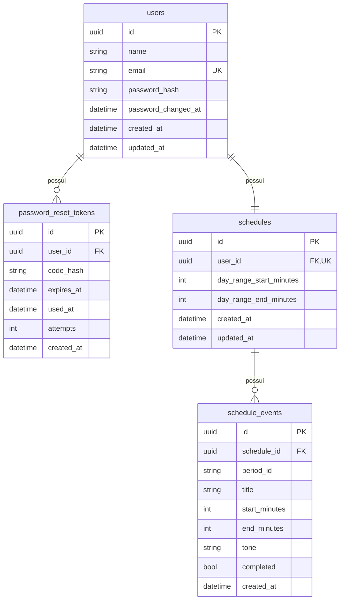
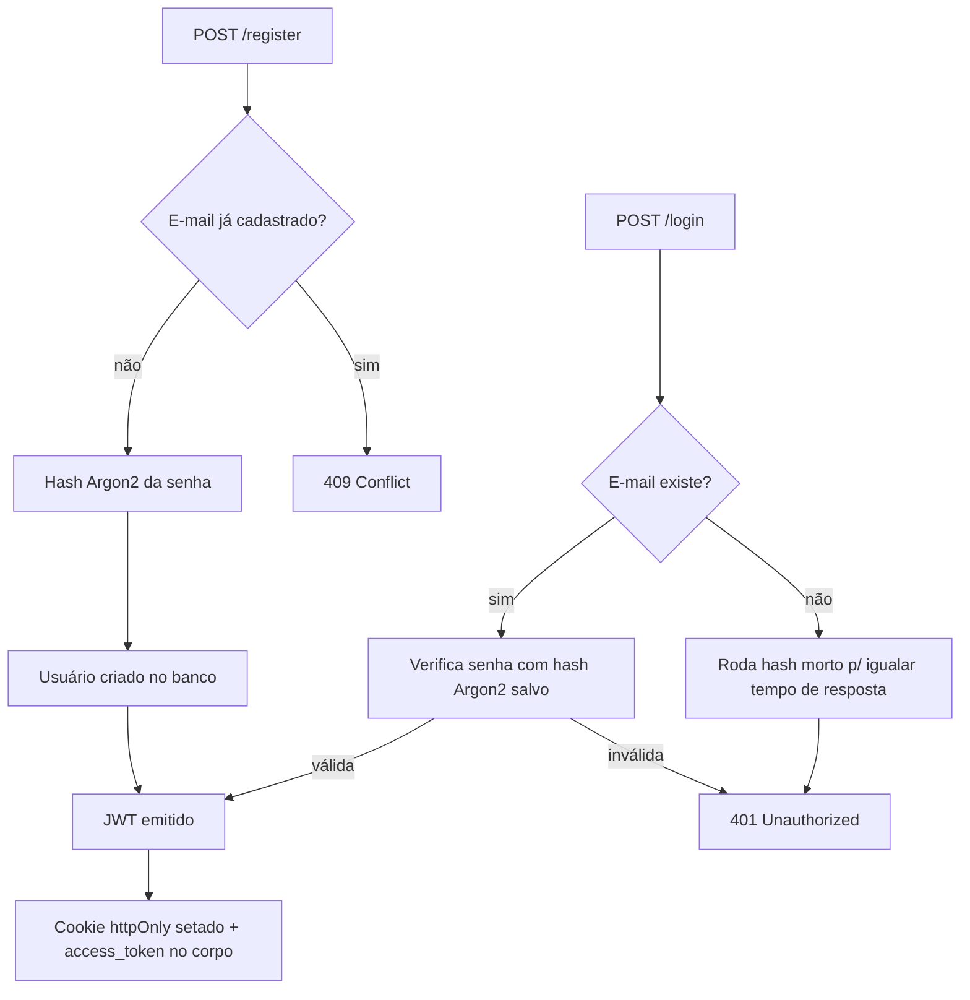
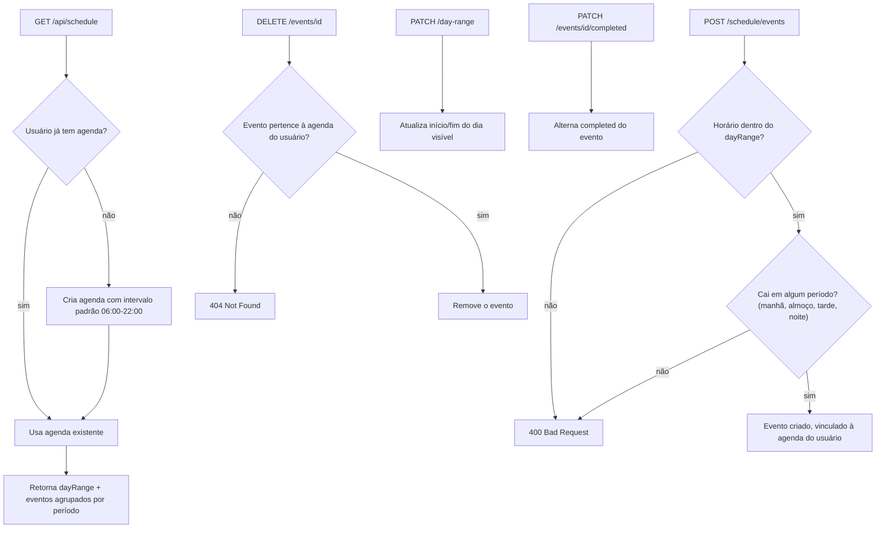
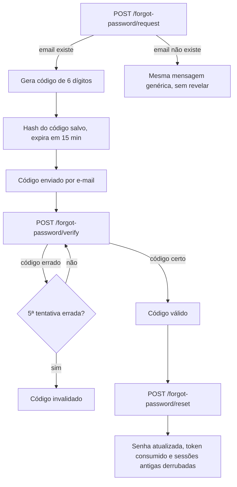

# Organiza.IA API

Backend completo em FastAPI para o Organiza.IA, assistente de produtividade pessoal. É a segunda etapa do projeto final: implementa autenticação real, persistência em PostgreSQL e recuperação de senha por e-mail, substituindo os mocks (MSW) usados na Part 1 (frontend), cujo código está na pasta `Card_12-Pratica_Projeto_Final-Part1/frontend` deste repositório.

## Descrição do Projeto

A Part 1 entregou a base visual do Organiza.IA com autenticação e agenda simuladas no navegador (MSW + `localStorage`). Esta etapa entrega a API real que sustenta essas telas: cadastro, login, sessão, atualização de perfil, o fluxo completo de recuperação de senha com envio de código por e-mail e a persistência da agenda (dia visível e cards de evento por período do dia).

A API foi desenhada para encaixar exatamente no contrato que o frontend já espera (mesmo formato de resposta `{message, session}` usado pelos handlers do MSW), e o mecanismo de sessão foi escolhido para bater com o jeito que o frontend já está construído: ele não guarda nem reenvia token nenhum, só espera que o servidor "lembre" de quem está logado. Por isso a API expõe a sessão via **cookie httpOnly**, mantendo o JWT também no corpo da resposta para quem for testar via Postman, Insomnia ou pelo Swagger.

## Tecnologias Utilizadas

- FastAPI.
- PostgreSQL com SQLAlchemy 2.0 (mapeamento via `mapped_as_dataclass`) e Alembic para migrações.
- JWT (PyJWT) para emissão e validação dos tokens de sessão.
- Cookie httpOnly para a sessão consumida pelo frontend, com fallback por `Authorization: Bearer` para testes manuais.
- Pydantic / Pydantic Settings para validação de entrada e saída e configuração via `.env`.
- pwdlib com Argon2 para hash de senha.
- FastAPI-Mail para o envio do código de recuperação de senha.
- pytest + pytest-cov para os testes automatizados.
- Ruff para lint e formatação.
- Docker e Docker Compose para subir API e banco juntos.

## Arquitetura do Backend

O projeto segue uma separação simples por camadas: rotas finas em `routers/`, regras de autenticação e hashing isoladas em `security.py`, schemas de entrada/saída em `schemas.py` e o acesso ao banco centralizado em `database.py` / `models.py`. Cada router só conhece os schemas e as funções de `security.py`; nenhuma rota monta SQL ou manipula hash diretamente.

```text
backend/
  organiza_ia_api/
    app.py                # cria o FastAPI, CORS, exception handlers e inclui os routers
    settings.py            # Settings (Pydantic Settings) lidas do .env
    database.py             # engine SQLAlchemy e get_session (dependency)
    models.py                # User, PasswordResetToken, Schedule e ScheduleEvent (SQLAlchemy + dataclass)
    schemas.py                 # schemas Pydantic de entrada/saída e validações
    security.py                 # hash de senha, JWT, extração do usuário autenticado
    mail.py                      # envio do código de recuperação via FastAPI-Mail
    routers/
      auth.py                      # registro, login, sessão, logout
      password_reset.py            # solicitar/verificar/redefinir senha
      users.py                      # perfil do usuário autenticado
      schedule.py                   # dia visível e cards de evento da agenda

  migrations/                # migrações Alembic (3 revisões, detalhadas na seção Banco de Dados)
  tests/                      # testes automatizados (pytest), banco SQLite em memória
  Dockerfile
  pyproject.toml

docker-compose.yml            # sobe o Postgres e a API juntos
.env / .env.example           # configuração usada pelo docker-compose
```

### Decisões de Arquitetura

**Sessão via cookie httpOnly, com Bearer como alternativa.** O frontend da Part 1 não tem nenhuma lógica de token: `auth-api.ts` chama `/api/auth/login` e só lê o campo `session` da resposta, sem guardar `access_token` em lugar nenhum. Para a API real funcionar com esse frontend sem precisar alterá-lo, `/login` e `/register` setam um cookie `httpOnly` com o JWT (que o navegador reenvia sozinho em `/session`, `/users/me` etc.), e `/logout` limpa esse cookie. A dependência `get_current_user` aceita o cookie **ou** um header `Authorization: Bearer <token>` — o header explícito tem prioridade quando os dois estão presentes, já que representa uma intenção clara de quem está chamando a API diretamente (Postman, Insomnia, Swagger).

**Contrato de erro compatível com o frontend.** As respostas de erro voltam como `{"message": "..."}` em vez do formato padrão do FastAPI (`{"detail": ...}`), via `exception_handler` em `app.py`. Isso é o mesmo formato que os handlers MSW do frontend já devolvem, então a troca do mock pela API real não exige nenhuma mudança em como o frontend lê erros. O handler é registrado em `starlette.exceptions.HTTPException` (não na subclasse `fastapi.HTTPException`): erros de roteamento como 404 de rota inexistente e 405 de método errado são levantados pelo Starlette diretamente na classe-mãe, e registrar só na subclasse os deixaria escapar no formato `{"detail": ...}`. Esses erros de roteamento também são traduzidos ("Rota não encontrada.", "Método não permitido."), mantendo o contrato 100% em português. Um handler genérico para `Exception` cobre qualquer falha não prevista (ex.: banco fora do ar) com a mesma mensagem genérica em JSON, e loga o erro real no servidor.

**Segurança no fluxo de autenticação.** Senhas são hasheadas com Argon2 (`pwdlib`). Login e solicitação de recuperação de senha rodam um hash "morto" mesmo quando o e-mail não existe, para o tempo de resposta não revelar quais e-mails estão cadastrados (mitigação de timing attack / enumeração de contas). O código de recuperação de senha (6 dígitos) é hasheado no banco, expira em 15 minutos (configurável) e tem limite de 5 tentativas antes de ser invalidado, fechando a porta pra força bruta contra um código de 1 milhão de combinações.

**Trocar a senha derruba todas as sessões.** O JWT carrega um claim `pwv` (password version) com a data da última troca de senha. Quando a senha muda — pelo perfil (`PATCH /api/users/me`) ou pelo fluxo de recuperação — todos os tokens emitidos antes deixam de validar, desconectando qualquer sessão aberta em outros navegadores/dispositivos. Quem trocou a senha pelo perfil recebe um cookie novo na mesma resposta e continua logado.

**Rate limit e higiene no fluxo de recuperação.** O `/forgot-password/request` aceita no máximo 3 solicitações por conta a cada 15 minutos — acima disso a resposta continua a mesma mensagem genérica (um 429 revelaria quais e-mails existem), mas nenhum código novo é emitido, impedindo tanto o spam na caixa de entrada da vítima quanto o "reset" do contador de tentativas via códigos novos. Cada solicitação nova invalida os códigos anteriores ainda ativos (um único código válido por vez) e apaga os tokens além do prazo de retenção (1 hora), então a tabela não cresce indefinidamente.

**Limites de tamanho em toda entrada.** Todos os campos de texto têm teto de tamanho validado com mensagem em português (nome 120, e-mail 254, senha 128, título de card 100, `userId` 64, código com exatamente 6 dígitos), e um middleware rejeita com `413` qualquer corpo de requisição acima de 64 KB antes mesmo do JSON ser parseado — nenhum payload gigante malicioso chega ao Argon2 ou ao banco.

**Corridas tratadas nos pontos de escrita.** Cadastro, troca de e-mail e criação lazy da agenda seguem o padrão "checa e insere"; se dois requests simultâneos passarem pela checagem, a unique constraint do banco barra o segundo e a API converte o erro em `409` (ou reusa a agenda existente) em vez de estourar `500`.

**Pool de conexões resiliente.** O engine do SQLAlchemy usa `pool_pre_ping=True` (testa a conexão com um `SELECT 1` antes de entregá-la a um request, evitando que uma conexão morta — restart do Postgres, blip de rede — derrube uma requisição com 500) e `pool_recycle=1800` (recicla conexões com mais de 30 min, para não depender de nenhum idle timeout do lado do banco). O pool em si usa os defaults do SQLAlchemy (`QueuePool`, 5 conexões de base + 10 de overflow por processo), suficiente para o volume de um projeto pessoal.

## Banco de Dados

PostgreSQL, com **quatro tabelas de domínio** criadas por três migrações Alembic: `2ce92a5c89ae` (`users` e `password_reset_tokens`), `b4e1f2a3c5d6` (`schedules` e `schedule_events`) e `a1f4c8d92b37` (coluna `users.password_changed_at`, índices nas FKs consultadas com frequência — `password_reset_tokens.user_id`/`expires_at` e `schedule_events.schedule_id` — e remoção dos defaults `now()` do banco: todos os timestamps passam a ser gerados no Python, sempre em UTC, para não depender do timezone do servidor Postgres).

Além dessas quatro, o banco tem uma **quinta tabela**, `alembic_version`, criada e mantida pelo próprio Alembic: guarda uma única linha com a revisão de migração atualmente aplicada (é assim que o `alembic upgrade head` sabe de onde continuar). Ela não aparece no diagrama abaixo por ser infraestrutura de versionamento, não parte do domínio do produto.



- `users.email` é único; o e-mail é normalizado (lowercase) antes de salvar ou buscar, evitando duplicidade por diferença de caixa.
- `password_reset_tokens` guarda só o **hash** do código de 6 dígitos, nunca o código em texto puro. `used_at` marca o token como consumido (sucesso, estouro de tentativas ou substituição por um código mais novo) e `attempts` é incrementado a cada código errado. Tokens além do prazo de retenção (1 hora) são apagados automaticamente a cada nova solicitação.
- `users.password_changed_at` registra a última troca de senha; o JWT carrega esse valor no claim `pwv` e tokens emitidos antes da troca são rejeitados (toda sessão aberta cai quando a senha muda).
- `schedules` tem uma relação 1:1 com `users` (`user_id` é `UNIQUE`): cada usuário tem uma única agenda, criada sob demanda (lazy) no primeiro acesso a `GET /api/schedule`. Guarda só o intervalo do dia visível (`day_range_start_minutes`/`day_range_end_minutes`, em minutos desde 00:00).
- `schedule_events` tem uma relação 1:N com `schedules`: cada card de evento pertence a uma agenda e carrega seu próprio horário (`start_minutes`/`end_minutes`), o período do dia em que cai (`period_id`: manhã/almoço/tarde/noite, calculado no backend a partir do horário) e o estado de conclusão (`completed`).
- Não há tabela de organizações nem de papéis/permissões: o tema do Organiza.IA é um assistente pessoal de uso individual, não uma ferramenta multi-tenant, então esse recorte do desafio (explicitamente opcional "caso necessário para o tema escolhido") não se aplica aqui. O "gerenciamento de usuários" do desafio se resolve, nesse escopo, pelo próprio ciclo de vida da conta: cadastro (`/register`) e autogestão do perfil (`GET`/`PATCH /api/users/me`) — não existe um papel de administrador nem listagem de outros usuários, porque não há hierarquia entre contas no domínio do produto.

## Funcionalidades e Endpoints

| Método | Rota | Descrição | Autenticação |
|---|---|---|---|
| POST | `/api/auth/register` | Cria a conta, já loga (seta cookie + retorna `access_token`) | - |
| POST | `/api/auth/login` | Autentica e seta a sessão | - |
| GET | `/api/auth/session` | Retorna a sessão atual (`null` se não autenticado) | opcional |
| POST | `/api/auth/logout` | Limpa o cookie de sessão | - |
| POST | `/api/auth/forgot-password/request` | Gera e envia por e-mail um código de 6 dígitos | - |
| POST | `/api/auth/forgot-password/verify` | Valida o código antes de redefinir a senha | - |
| POST | `/api/auth/forgot-password/reset` | Redefine a senha usando o código válido | - |
| GET | `/api/users/me` | Retorna os dados do usuário autenticado | obrigatória |
| PATCH | `/api/users/me` | Atualiza nome, e-mail e/ou senha do usuário autenticado | obrigatória |
| GET | `/api/schedule` | Retorna a agenda do usuário (intervalo do dia + cards por período), criando-a se ainda não existir | obrigatória |
| PATCH | `/api/schedule/day-range` | Atualiza o intervalo do dia visível na agenda | obrigatória |
| POST | `/api/schedule/events` | Cria um card de evento (calcula o período do dia automaticamente pelo horário) | obrigatória |
| DELETE | `/api/schedule/events/{event_id}` | Remove um card de evento | obrigatória |
| PATCH | `/api/schedule/events/{event_id}/completed` | Alterna o status de concluído do card | obrigatória |

### Fluxo de cadastro e login



### Fluxo da agenda



### Fluxo de recuperação de senha



Todas as entradas são validadas com Pydantic (formato de e-mail, senha entre 6 e 128 caracteres, confirmação de senha igual à senha, código com exatamente 6 dígitos numéricos) e a API nunca devolve a senha ou o hash dela em nenhuma resposta.

## Como Testar

A forma mais rápida é pelo **Swagger UI**, em `http://localhost:8001/docs` (assumindo a porta mapeada no `docker-compose.yml`):

1. Abra `POST /api/auth/register` (ou `/login`), clique em "Try it out", preencha o corpo e execute.
2. A resposta traz `access_token` no corpo. Clique no cadeado "Authorize" no topo da página e cole o token (sem prefixo `Bearer`) — o Swagger já preenche o header sozinho a partir daí.
3. Repare também que, como a chamada do passo 1 já foi feita pelo próprio navegador, o cookie httpOnly da sessão já foi setado: as rotas protegidas (`/api/users/me`) funcionam mesmo sem usar o "Authorize", testando direto pelo "Try it out".
4. Use `GET /api/users/me`, `PATCH /api/users/me`, as rotas de `/api/auth/forgot-password` e as rotas de `/api/schedule` normalmente a partir daí.

Também dá pra testar com Insomnia/Postman, com o mesmo fluxo (chamar `/login`, copiar `access_token`, usar como Bearer nas rotas protegidas).

### Testes automatizados

```bash
docker compose exec backend pytest -v
# ou, com cobertura:
docker compose exec backend pytest --cov=organiza_ia_api
```

92 testes, com **100% de cobertura de linha** (`pytest --cov=organiza_ia_api`), cobrindo registro, login (sucesso e falha), sessão via cookie e via Bearer, logout, atualização de perfil (incluindo troca de e-mail com sucesso, conflito de e-mail e validação de senha/confirmação), o fluxo inteiro de recuperação de senha (código certo, errado, e-mail desconhecido, reuso bloqueado, limite de tentativas, rate limit de solicitações, invalidação do código anterior e limpeza de tokens antigos), a derrubada de sessões após troca/reset de senha, a agenda (criação lazy, validação de horário fora do intervalo do dia, cálculo de período, conclusão e remoção de eventos), corridas de escrita simuladas (cadastro/e-mail duplicado e criação concorrente da agenda, incluindo a variante em que a transação vencedora sofre rollback e o erro precisa virar o 500 genérico), limites de tamanho de entrada (nome, e-mail, senha, corpo de requisição acima de 64 KB), tradução das mensagens de validação, o contrato `{"message": ...}` também para erros de roteamento (404 de rota inexistente, 405 de método errado) e para exceções não previstas (500 genérico), e casos de token inválido (JWT malformado, `sub` que não é UUID, token válido para usuário inexistente). As mensagens de erro são comparadas literalmente (não só o status code), para o teste falhar se a mensagem certa vier associada ao motivo errado. Os testes rodam contra um banco SQLite em memória (substituído via dependency override) e não exigem `.env` nem Postgres — basta `pytest`.

## Como Executar Localmente

### Pré-requisitos

- Docker e Docker Compose.

### Passo a passo

1. Copie o arquivo de exemplo de variáveis de ambiente (na raiz do `Card_13-Pratica_Projeto-Final-Part2/`, um nível acima desta pasta):

   ```bash
   cp .env.example .env
   ```

   Ajuste pelo menos o `SECRET_KEY` para uma chave própria. As variáveis de e-mail (`MAIL_*`) já vêm com `MAIL_SUPPRESS_SEND=True`, então o envio é simulado por padrão — não é preciso configurar um servidor SMTP real só para testar a API.

2. Suba o banco e a API:

   ```bash
   docker compose up -d --build
   ```

   O serviço `backend` espera o Postgres ficar saudável e roda as migrações do Alembic automaticamente antes de subir o servidor (`alembic upgrade head && uvicorn ...`).

3. Acesse:

   ```text
   http://localhost:8001/docs
   ```

Para rodar **o servidor** sem Docker (Postgres já disponível na máquina), instale as dependências com Poetry a partir desta pasta (`backend/`) e copie o `.env.example` para um `.env` **dentro de `backend/`** (o `Settings` do projeto lê o `.env` relativo à pasta de onde o comando é executado). Os **testes** não precisam de `.env` nem de Postgres — `poetry run pytest` funciona direto:

```bash
cd backend
poetry install
cp ../.env.example .env   # edite o DATABASE_URL se o Postgres não estiver em localhost:5432
poetry run alembic upgrade head
poetry run task run
```

## Resultados Obtidos

A API cobre as funcionalidades obrigatórias do desafio — cadastro, login com JWT, recuperação de senha por e-mail e atualização de perfil — com persistência real em PostgreSQL, validação completa via Pydantic, senha hasheada com Argon2 e proteções extras (anti-enumeração de e-mail, anti-força-bruta e rate limit no código de recuperação, derrubada de sessões após troca de senha, limites de tamanho em todas as entradas e no corpo da requisição). Além disso, persiste a agenda (intervalo do dia e cards de evento por período) que na Part 1 vivia só no `localStorage` via mock. O contrato de resposta foi desenhado para encaixar no frontend da Part 1 sem exigir mudanças nele. Todos os endpoints foram testados manualmente (via Swagger/curl) e por uma suíte de 92 testes automatizados com 100% de cobertura de linha, ambos documentados acima.
