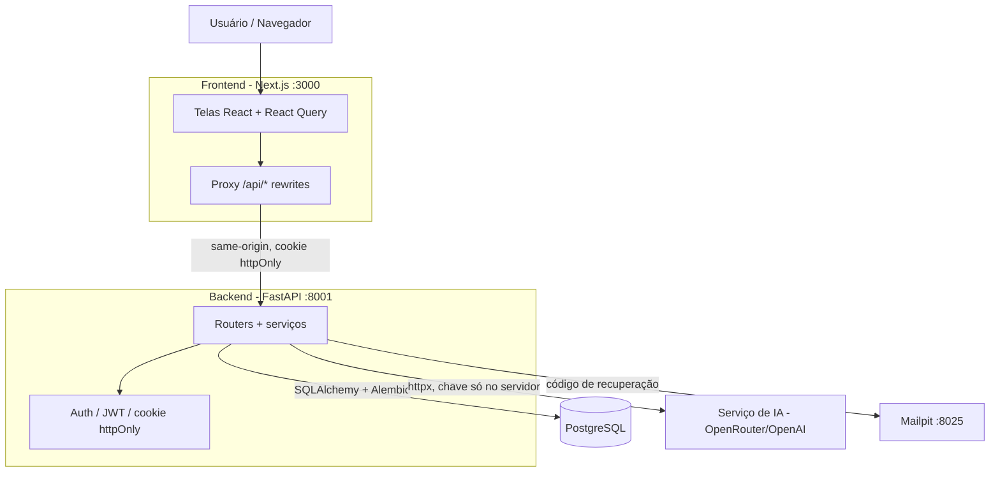
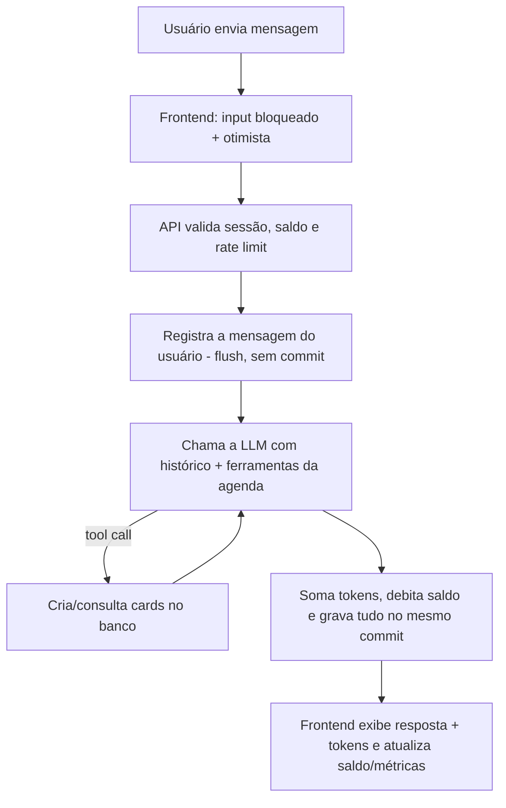

# Organiza.IA — Projeto Final (FastCamp Web)

Sistema web completo em que o usuário conversa com um **agente de chat inteligente** que também organiza sua rotina. O projeto reúne tudo o que foi construído ao longo do FastCamp: autenticação de usuários, chat com IA, dashboard de métricas individuais e um sistema de cobrança por tokens que simula a cobrança por uso.

> **Organiza.IA** é um assistente de produtividade pessoal: o usuário monta uma **rotina diária recorrente** (a mesma todo dia, sem datas) e acompanha, na tela principal, o dia em andamento. O mesmo agente que responde no chat cria e consulta cards nessa rotina de verdade.

Este README é o ponto de entrada do projeto. Para detalhes de cada camada, veja também os READMEs específicos:

- [`backend/README.md`](./backend/README.md) — API FastAPI: arquitetura, endpoints, banco, segurança e testes.
- [`frontend/README.md`](./frontend/README.md) — interface Next.js: telas, organização feature-based e prints.

---

## 1. Escopo do MVP

O sistema entrega os quatro pilares pedidos no desafio, todos funcionais e integrados:

| Pilar | O que faz |
|---|---|
| **Autenticação** | Cadastro, login, sessão via cookie httpOnly, logout, atualização de perfil e recuperação de senha por e-mail (código de 6 dígitos). |
| **Chat com agente inteligente** | Envio e resposta de mensagens com uma LLM real (OpenRouter/OpenAI), histórico persistido, input bloqueado durante o processamento e contagem de tokens. O agente usa *function calling* para criar/consultar cards da agenda. |
| **Dashboard de métricas** | Mensagens trocadas, tempo ativo (uso da IA), tokens consumidos, tarefas cumpridas e gráficos de consumo semanal, tarefas e interações diárias — todos por usuário autenticado. |
| **Cobrança por tokens** | Saldo atual, histórico de consumo/recargas e recarga por pacotes. Cada interação com a IA debita os tokens realmente consumidos; saldo zerado bloqueia o chat. |

Como diferencial, o agente não é um chat genérico: ele age sobre a agenda do usuário (planejamento da semana), o que dá um propósito claro ao consumo de tokens.

## 2. Arquitetura do Sistema

Quatro peças orquestradas: **frontend** (Next.js), **backend** (FastAPI), **banco** (PostgreSQL) e **serviço de IA** (OpenRouter, compatível com a API da OpenAI). O e-mail de recuperação de senha é capturado em desenvolvimento pelo **Mailpit**.



**Orquestração dos dados.** O navegador nunca fala direto com o banco nem com a LLM. O frontend faz proxy de `/api/*` para a API (via `rewrites` do Next), então o cookie httpOnly de sessão viaja same-origin, sem CORS no navegador. A API valida a sessão, aplica regras de negócio (saldo, rate limit, validação), persiste no PostgreSQL e — só quando o fluxo do chat exige — chama o serviço de IA com a chave que vive **exclusivamente no servidor**. As respostas seguem o contrato `{message, ...}` que o frontend espera.

**Fluxo de uma mensagem de chat** (integra as quatro peças):



### Stack

| Camada | Tecnologias |
|---|---|
| Frontend | Next.js 16 (App Router), React 19, TypeScript, Tailwind CSS 4, shadcn/ui, TanStack React Query, Zustand, Zod, Recharts |
| Backend | FastAPI, SQLAlchemy 2.0, Alembic, Pydantic, PyJWT, pwdlib/Argon2, httpx, FastAPI-Mail |
| Banco | PostgreSQL 16 |
| IA | OpenRouter (compatível com a API de chat da OpenAI), configurável por `.env` |
| Infra/Dev | Docker Compose (Postgres + backend + frontend + Mailpit), pytest, Ruff, ESLint |

## 3. Interface de Usuário

Interface responsiva com Tailwind + shadcn/ui, cobrindo todos os casos de uso:

- **/auth** — login e cadastro (formulário alternável, validação Zod).
- **/auth/forgot-password** — recuperação de senha em etapas (solicitar → validar código → redefinir → sucesso).
- **/** — rotina diária recorrente (timeline por períodos, criar/concluir/remover cards, ajustar o intervalo do dia). Os cards representam a rotina que se repete todo dia, sem datas específicas.
- **/ai-chat** — chat com IA (input bloqueado durante o processamento, histórico, tokens por resposta, aviso de saldo esgotado).
- **/dashboard** — métricas reais e gráficos.
- **/billing** — saldo, recarga e extrato de tokens.

Os prints de cada tela estão no [README do frontend](./frontend/README.md#prints-das-telas) e em `frontend/public/screenshots/`. O fluxograma de navegação do usuário também está lá.

## 4. API e Documentação (Swagger)

A API expõe a documentação interativa em **`http://localhost:8001/docs`** (Swagger UI, gerado automaticamente pelo FastAPI e cobrindo todos os endpoints). Resumo das rotas:

| Grupo | Rotas |
|---|---|
| Auth | `POST /api/auth/register` · `POST /api/auth/login` · `GET /api/auth/session` · `POST /api/auth/logout` |
| Recuperação de senha | `POST /api/auth/forgot-password/{request,verify,reset}` |
| Perfil | `GET /api/users/me` · `PATCH /api/users/me` |
| Agenda | `GET /api/schedule` · `PATCH /api/schedule/day-range` · `POST /api/schedule/events` · `DELETE`/`PATCH` `/api/schedule/events/{id}` |
| Chat | `POST /api/chat/messages` · `GET /api/chat/messages` |
| Métricas | `GET /api/metrics` |
| Cobrança | `GET /api/billing` · `POST /api/billing/recharge` |

Os fluxogramas dos fluxos de dados (cadastro/login, chat+cobrança, recuperação de senha, agenda) estão detalhados no [README do backend](./backend/README.md#funcionalidades-e-endpoints).

## 5. Chat — metodologia

Os quatro pontos pedidos no requisito 3.5:

- **Input bloqueado durante o processamento.** Ao enviar, o campo e o botão são desabilitados, um indicador de "digitando" aparece e o botão vira "parar". O envio usa um `AbortController`; se o usuário cancela, a interface reconcilia o estado com o servidor (a mensagem já persistida e o saldo).
- **Armazenamento no banco.** Cada mensagem (usuário e assistente) é gravada na tabela `chat_messages` com papel, conteúdo e os tokens reais de entrada/saída. A mensagem do usuário, a resposta da IA e o débito de tokens são persistidos na **mesma transação** — ou grava tudo, ou nada; se a LLM falha, um rollback descarta tudo, sem deixar mensagem órfã sem resposta. A linha do usuário fica travada (`SELECT ... FOR UPDATE`) por toda a chamada, então envios concorrentes não furam o saldo nem o rate limit.
- **Exibição do histórico.** O chat carrega o histórico paginado de `GET /api/chat/messages` ao abrir; o backend devolve as mensagens em ordem cronológica, isoladas por usuário.
- **Contabilização de tokens.** Os números de tokens **não são calculados localmente**: vêm do campo `usage` (`prompt_tokens`/`completion_tokens`) que a própria API do OpenRouter retorna em cada resposta. O backend apenas soma esses valores ao longo de todas as rodadas da conversa (incluindo as chamadas de ferramenta) e debita o total do saldo na **mesma transação** que grava a resposta, com o consumo exibido em cada bolha.

## 6. Dashboard de Métricas

`GET /api/metrics` agrega, por usuário: total de mensagens, total de tokens, tarefas cumpridas, **tempo ativo** (soma dos intervalos ≤ 5 min entre mensagens consecutivas — mede uso real da IA, não tempo de site), tokens da semana vs. limite, e séries por dia da semana (tarefas cumpridas/pendentes e interações). Os agregados são calculados em SQL e reconvertidos para o fuso do produto (`America/Sao_Paulo`) na hora de agrupar por dia/semana. A tela consome tudo via React Query, com skeleton e estado de erro com "tentar novamente".

## 7. Cobrança por Tokens

Cada conta começa com **10.000 tokens**. Cada interação com a IA debita os tokens realmente consumidos — os valores reportados pelo próprio OpenRouter no campo `usage` de cada resposta, somados pelo backend ao longo das rodadas — sob `SELECT ... FOR UPDATE` para não haver perda por concorrência, na mesma transação que persiste a conversa. Saldo zerado retorna `402` e o chat bloqueia o input com um aviso e link para recarregar. A recarga é simulada por pacotes fixos (**1.000 / 5.000 / 10.000**), e a tela `/billing` mostra saldo, extrato (débitos e recargas com o saldo resultante) e os botões de recarga renderizados a partir dos pacotes que a própria API informa.

## 8. Como Executar (instruções de uso)

### Pré-requisitos

- Docker e Docker Compose.
- (Opcional, para o chat) uma chave de API compatível com OpenAI/OpenRouter.

### Passo a passo

1. **Configure o `.env`** a partir do exemplo, na raiz deste projeto:

   ```bash
   cp .env.example .env
   ```

   Ajuste:
   - `SECRET_KEY` — obrigatório, use uma chave própria e forte.
   - `AI_API_KEY` — necessária **só para o chat**. Sem ela, todo o resto (auth, agenda, cobrança, métricas) funciona; o `POST /api/chat/messages` responde `503`. O padrão usa o OpenRouter (`AI_BASE_URL`) com uma lista de modelos gratuitos em `AI_MODEL` (cada um é fallback do anterior).
   - As variáveis `MAIL_*` já apontam para o Mailpit do compose — não é preciso um SMTP real.

2. **Suba tudo:**

   ```bash
   docker compose up -d --build
   ```

   O backend espera o Postgres ficar saudável e roda as migrações do Alembic automaticamente antes de iniciar.

3. **Acesse:**

   | Serviço | URL |
   |---|---|
   | Frontend (aplicação) | http://localhost:3000 |
   | API | http://localhost:8001 |
   | Swagger (documentação da API) | http://localhost:8001/docs |
   | Mailpit (caixa de e-mail de dev) | http://localhost:8025 |

4. Crie uma conta pela tela de cadastro e explore. Para testar a recuperação de senha, o código enviado aparece no Mailpit.

Para rodar cada camada isoladamente (sem Docker), veja as seções "Como Executar Localmente" nos READMEs de [backend](./backend/README.md#como-executar-localmente) e [frontend](./frontend/README.md#como-executar-localmente).

## 9. Como reproduzir os testes (validação)

**Testes automatizados do backend** — 165 testes com **cobertura de linha em torno de 99%**, cobrindo auth (inclusive lockout de login), recuperação de senha, agenda, chat (com a LLM mockada), ferramentas da IA, métricas e cobrança, além de corridas de escrita, limites de entrada e o contrato de erro. Não precisam de `.env` nem de Postgres (banco SQLite em memória):

```bash
docker compose exec backend pytest --cov=organiza_ia_api
# ou, sem Docker, a partir de backend/: poetry run task test
```

**Verificação manual pelo Swagger (fluxo ponta a ponta).** Com o ambiente no ar (`docker compose up`), abra `http://localhost:8001/docs` e siga o fluxo pela própria UI:

1. `POST /api/auth/register` — cria a conta; a resposta já traz `access_token` e o cookie de sessão é setado no navegador.
2. `GET /api/schedule`, `POST /api/schedule/events` — cria e lista cards da agenda.
3. `POST /api/chat/messages` — envia uma mensagem ao agente (requer `AI_API_KEY` no `.env`; sem chave, retorna `503`) e observe os tokens contabilizados na resposta.
4. `GET /api/billing` — confira o saldo debitado e o extrato; `POST /api/billing/recharge` recarrega.
5. `GET /api/metrics` — veja as métricas atualizadas.
6. Para a recuperação de senha, o código enviado por `POST /api/auth/forgot-password/request` aparece no Mailpit (`http://localhost:8025`).

O mesmo fluxo pode ser exercitado pela interface real em `http://localhost:3000`, navegando pelas telas.

**Qualidade do frontend:**

```bash
cd frontend
npm run lint
npm run typecheck
npm run build
```

## 10. Segurança

- Senhas com **Argon2**; sessão por **cookie httpOnly**; JWT com claim `pwv` que **derruba todas as sessões** na troca de senha.
- **Anti-enumeração de contas**: login e recuperação de senha gastam o mesmo tempo mesmo quando o e-mail não existe ou não há código pendente (hash "morto").
- **Rate limit e lockout**: 3 solicitações de recuperação por conta a cada 15 min; 10 mensagens de chat por minuto por usuário; login travado por 15 min após 5 senhas erradas seguidas.
- **Chave da LLM só no servidor** — nunca no bundle do frontend.
- Débito de tokens, checagem de saldo e validação das ferramentas da IA são feitos **no servidor**, à prova de concorrência.
- Limite de tamanho de corpo (`413` acima de 64 KB) e validação de todos os campos; erros sempre no contrato `{message}` em português, sem stack trace.

## 11. Estrutura do Repositório

```text
Card_14-Pratica_Projeto-Final-Part-Final/
  backend/            # API FastAPI (ver backend/README.md)
  frontend/           # Interface Next.js (ver frontend/README.md)
  docker-compose.yml  # Postgres + backend + frontend + Mailpit
  .env.example        # Modelo de configuração (copie para .env)
  README.md           # Este arquivo
```
