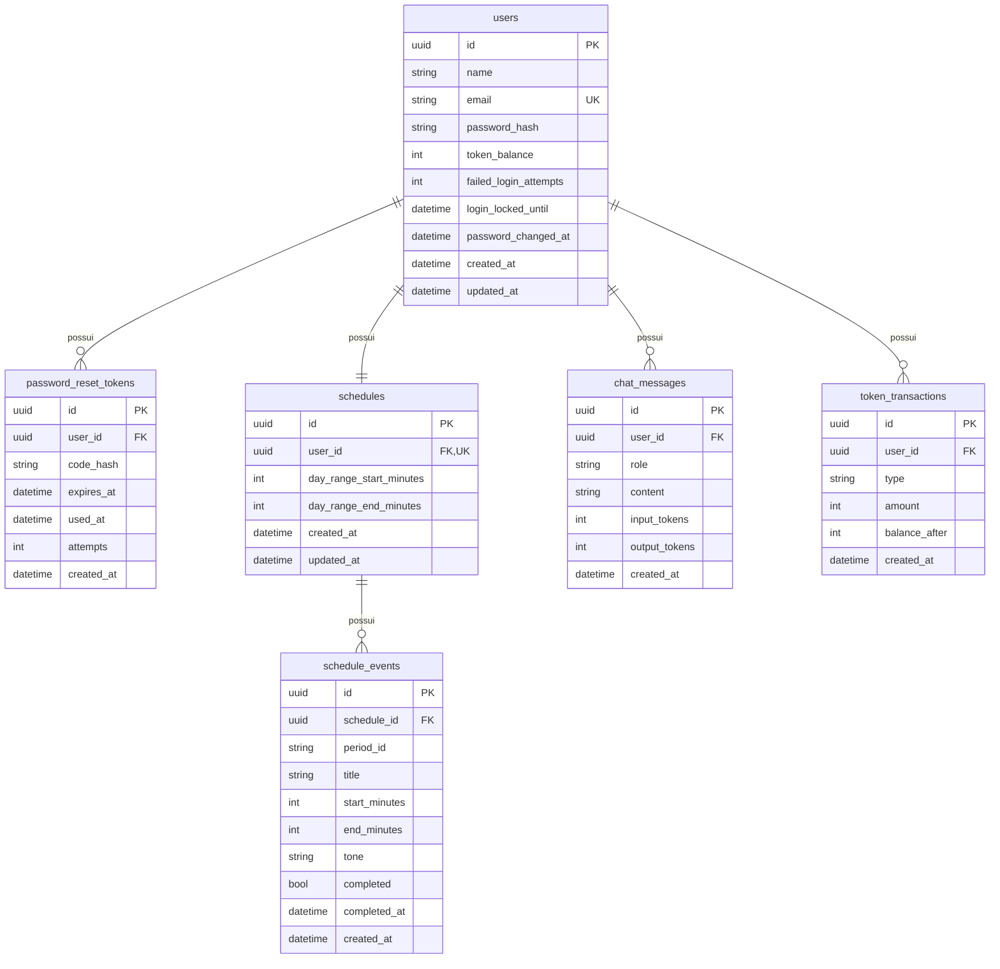
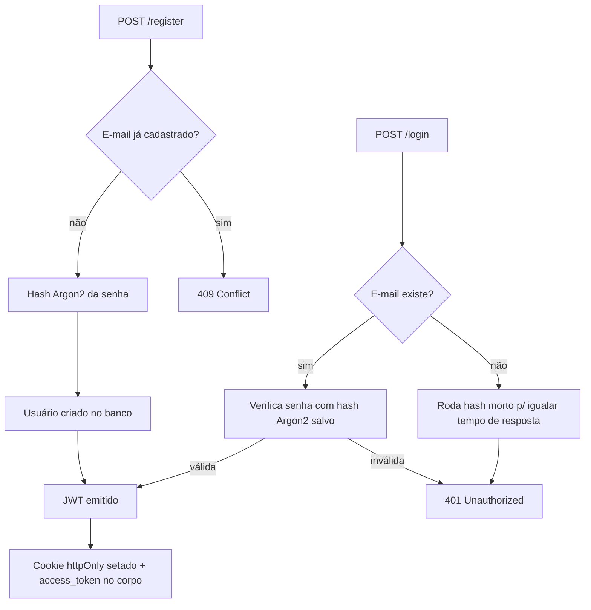
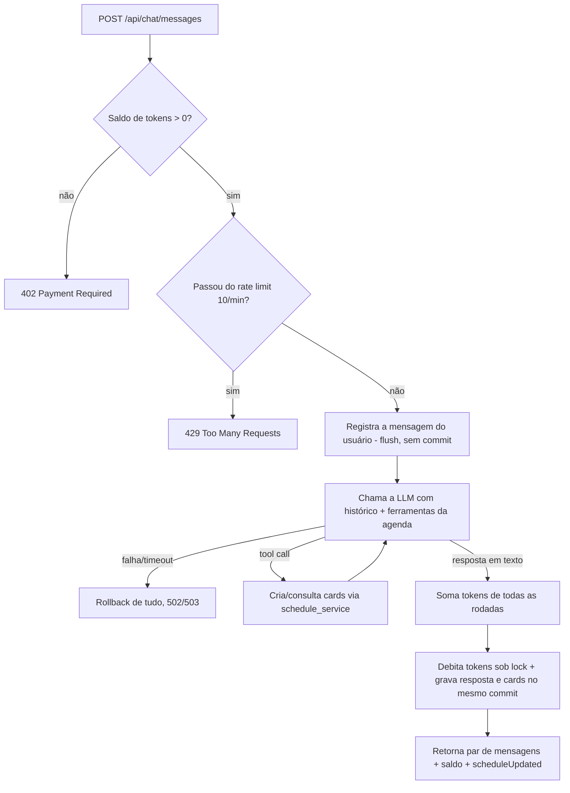
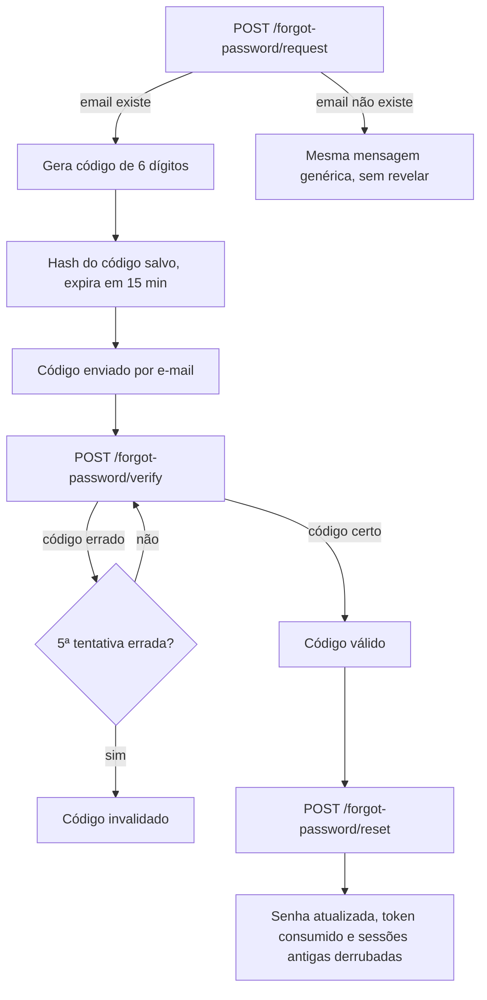

# Organiza.IA API

Backend completo em FastAPI para o Organiza.IA, assistente de produtividade pessoal movido por IA. É a etapa final do projeto: sobre a autenticação, a persistência e a agenda entregues na Part 2 (Card_13), esta versão acrescenta o **chat com um agente inteligente** (via OpenRouter/OpenAI com function calling), o **dashboard de métricas** e o **sistema de cobrança por tokens**, fechando o MVP pedido no desafio.

## Descrição do Projeto

A API sustenta todas as telas do frontend (Next.js) sem que ele precise conhecer o banco ou a LLM: cadastro, login, sessão, perfil, recuperação de senha por e-mail, a agenda diária (dia visível e cards de evento por período) e, agora, o chat com IA, as métricas de uso e o saldo/extrato de tokens.

O contrato de resposta segue o formato `{message, ...}` que o frontend já espera, e o mecanismo de sessão foi escolhido para bater com o jeito que o frontend está construído: ele não guarda nem reenvia token nenhum, só espera que o servidor "lembre" de quem está logado. Por isso a API expõe a sessão via **cookie httpOnly**, mantendo o JWT também no corpo da resposta para quem for testar via Postman, Insomnia ou pelo Swagger.

A chave da LLM vive **somente no servidor** (`.env`), nunca no bundle do frontend: o navegador conversa com a IA exclusivamente através desta API, que valida saldo, conta tokens e aplica rate limit antes de chamar o provedor.

## Tecnologias Utilizadas

- FastAPI.
- PostgreSQL com SQLAlchemy 2.0 (mapeamento via `mapped_as_dataclass`) e Alembic para migrações.
- httpx para o cliente HTTP assíncrono que fala com a LLM (OpenRouter/OpenAI-compatível).
- JWT (PyJWT) para emissão e validação dos tokens de sessão.
- Cookie httpOnly para a sessão consumida pelo frontend, com fallback por `Authorization: Bearer` para testes manuais.
- Pydantic / Pydantic Settings para validação de entrada e saída e configuração via `.env`.
- pwdlib com Argon2 para hash de senha.
- FastAPI-Mail para o envio do código de recuperação de senha.
- pytest + pytest-cov para os testes automatizados.
- Ruff para lint e formatação.
- Docker e Docker Compose para subir API, banco, frontend e Mailpit juntos.

## Arquitetura do Backend

O projeto segue uma separação simples por camadas: rotas finas em `routers/`, regras de negócio reutilizáveis extraídas para módulos de serviço (`schedule_service.py`, `billing_service.py`), o cliente da LLM isolado em `ai.py`, autenticação e hashing em `security.py`, schemas de entrada/saída em `schemas.py` e o acesso ao banco centralizado em `database.py` / `models.py`. Nenhum router monta SQL cru nem fala direto com a LLM.

```text
backend/
  organiza_ia_api/
    app.py                # cria o FastAPI, CORS, middleware de tamanho, exception handlers e inclui os routers
    settings.py            # Settings (Pydantic Settings) lidas do .env
    database.py             # engine SQLAlchemy e get_session (dependency)
    models.py                # User, PasswordResetToken, Schedule, ScheduleEvent, ChatMessage, TokenTransaction
    schemas.py                 # schemas Pydantic de entrada/saída e validações
    security.py                 # hash de senha, JWT, extração do usuário autenticado
    mail.py                      # envio do código de recuperação via FastAPI-Mail
    ai.py                         # cliente da LLM: system prompt, tools (function calling), fallback de modelos
    schedule_service.py           # regras da agenda, compartilhadas entre o router e as ferramentas da IA
    billing_service.py            # débito/recarga de tokens sob lock, com lançamento em token_transactions
    routers/
      auth.py                      # registro, login, sessão, logout
      password_reset.py            # solicitar/verificar/redefinir senha
      users.py                      # perfil do usuário autenticado
      schedule.py                   # dia visível e cards de evento da agenda
      chat.py                       # envio/histórico de mensagens do chat com IA
      metrics.py                    # métricas de uso do usuário (dashboard)
      billing.py                    # saldo, extrato e recarga de tokens

  migrations/                # migrações Alembic (8 revisões, detalhadas na seção Banco de Dados)
  tests/                      # testes automatizados (pytest), banco SQLite em memória
  Dockerfile
  pyproject.toml

docker-compose.yml            # sobe Postgres + backend + frontend + Mailpit
.env / .env.example           # configuração usada pelo docker-compose (um nível acima, na raiz do Card_14)
```

### Decisões de Arquitetura

**Sessão via cookie httpOnly, com Bearer como alternativa.** O frontend não tem nenhuma lógica de token: `auth-api.ts` chama `/api/auth/login` e só lê o campo `session` da resposta, sem guardar `access_token` em lugar nenhum. Para a API funcionar com esse frontend sem alterá-lo, `/login` e `/register` setam um cookie `httpOnly` com o JWT (que o navegador reenvia sozinho em `/session`, `/users/me` etc.), e `/logout` limpa esse cookie. A dependência `get_current_user` aceita o cookie **ou** um header `Authorization: Bearer <token>` — o header explícito tem prioridade quando os dois estão presentes, já que representa uma intenção clara de quem está chamando a API diretamente (Postman, Insomnia, Swagger).

**Contrato de erro compatível com o frontend.** As respostas de erro voltam como `{"message": "..."}` em vez do formato padrão do FastAPI (`{"detail": ...}`), via `exception_handler` em `app.py`. O handler é registrado em `starlette.exceptions.HTTPException` (não na subclasse `fastapi.HTTPException`): erros de roteamento como 404 de rota inexistente e 405 de método errado são levantados pelo Starlette diretamente na classe-mãe, e registrar só na subclasse os deixaria escapar no formato `{"detail": ...}`. Esses erros de roteamento também são traduzidos ("Rota não encontrada.", "Método não permitido."), mantendo o contrato 100% em português. Um handler genérico para `Exception` cobre qualquer falha não prevista (ex.: banco fora do ar) com a mesma mensagem genérica em JSON, e loga o erro real no servidor.

**Serviço de IA isolado e agnóstico de provedor (`ai.py`).** O cliente fala com qualquer endpoint compatível com a API de chat da OpenAI — por padrão o **OpenRouter**, configurável por `AI_BASE_URL`/`AI_MODEL`. O system prompt restringe o agente ao contexto de planejamento (fora disso ele responde que não tem acesso). `AI_MODEL` aceita uma **lista** de modelos separados por vírgula: como os modelos gratuitos do OpenRouter vivem rate-limited, cada um funciona como fallback do anterior. Falhas viram `{message}` em português: `503` sem chave configurada, `502` para timeout/erro do provedor.

**Agente com ferramentas (function calling).** A IA cria e consulta cards da agenda de verdade através das ferramentas `create_schedule_event` e `list_schedule_events`. O loop de tool-calling roda no servidor (máx. 3 rodadas, a última forçada a texto para não entrar em loop), os argumentos são validados pelos **mesmos schemas** do CRUD da agenda, os efeitos só são persistidos no commit final do envio, e não há fallback para outro modelo depois que uma ferramenta já rodou (repetir a conversa duplicaria as ações). Os tokens de todas as rodadas são somados no débito. A contagem de tokens **não é feita localmente**: o backend lê o campo `usage` (`prompt_tokens`/`completion_tokens`) que o OpenRouter devolve em cada resposta e apenas acumula esses valores — se o provedor não reportar `usage`, o custo daquela rodada cai para zero. A lógica da agenda foi extraída para `schedule_service.py`, compartilhada entre o router de agenda e as ferramentas.

**Cobrança centralizada e à prova de concorrência (`billing_service.py`).** Débito (chat) e recarga usam o mesmo serviço, que lê o saldo pela **coluna** sob `SELECT ... FOR UPDATE` e grava com `UPDATE` atômico — evitando o problema clássico de a linha travada devolver o objeto já carregado no identity map da sessão e um envio concorrente sobrescrever o débito de outro. No chat, a linha do usuário é travada logo no início do envio e só liberada no commit final: a checagem de saldo e o rate limit valem por toda a duração da chamada à LLM, então requisições concorrentes do mesmo usuário não furam os limites em paralelo. A mensagem do usuário, a resposta e os cards criados pela IA são persistidos na **mesma transação** — ou grava tudo, ou nada: qualquer falha faz rollback e não deixa mensagem órfã sem resposta. O endpoint do chat roda de forma síncrona (offload para a threadpool do FastAPI), para as chamadas bloqueantes ao banco e o lock durante a conversa não segurarem o event loop.

**Segurança no fluxo de autenticação.** Senhas são hasheadas com Argon2 (`pwdlib`). Login e os endpoints de recuperação de senha rodam um hash "morto" mesmo quando o e-mail não existe **ou quando não há código pendente**, para o tempo de resposta não revelar quais e-mails estão cadastrados (mitigação de timing attack / enumeração). O código de recuperação (6 dígitos) é hasheado no banco, expira em 15 minutos (configurável) e tem limite de 5 tentativas antes de ser invalidado.

**Trocar a senha derruba todas as sessões.** O JWT carrega um claim `pwv` (password version) com a data da última troca de senha. Quando a senha muda — pelo perfil (`PATCH /api/users/me`) ou pelo fluxo de recuperação — todos os tokens emitidos antes deixam de validar, desconectando qualquer sessão aberta. Quem trocou a senha pelo perfil recebe um cookie novo na mesma resposta e continua logado.

**Rate limit e lockout em toda superfície cara.** O `/forgot-password/request` aceita no máximo 3 solicitações por conta a cada 15 minutos (acima disso, mesma mensagem genérica, sem emitir código novo). O `/api/chat/messages` aceita no máximo 10 mensagens por minuto por usuário (`429` acima disso), contadas na própria tabela `chat_messages` — cada mensagem dispara chamadas reais à LLM (custo/quota), então o teto barra rajadas de script sem atrapalhar quem digita. O `/api/auth/login` trava a conta por 15 minutos após 5 tentativas de senha erradas seguidas (`429`), contra força bruta; um login válido zera o contador.

**Limites de tamanho em toda entrada.** Todos os campos de texto têm teto validado com mensagem em português (nome 120, e-mail 254, senha 128, título de card 100, mensagem de chat 2000, código com exatamente 6 dígitos), e um middleware rejeita com `413` qualquer corpo acima de 64 KB antes do parse do JSON.

**Timestamps sempre em UTC no Python.** Todos os `created_at`/`updated_at` são gerados no Python como UTC naive (`models.utcnow`), sem depender do timezone do servidor Postgres — as migrações removem os defaults `now()` do banco para manter essa garantia. As métricas do dashboard reconvertem esses timestamps para o fuso do produto (`METRICS_TIMEZONE`, padrão `America/Sao_Paulo`) na hora de agrupar por dia/semana.

**Corridas tratadas nos pontos de escrita.** Cadastro, troca de e-mail e criação lazy da agenda seguem o padrão "checa e insere"; se dois requests simultâneos passarem pela checagem, a unique constraint do banco barra o segundo e a API converte o erro em `409` (ou reusa a agenda existente) em vez de estourar `500`.

**Pool de conexões resiliente.** O engine usa `pool_pre_ping=True` (testa a conexão com um `SELECT 1` antes de entregá-la, evitando 500 por conexão morta) e `pool_recycle=1800` (recicla conexões com mais de 30 min).

## Banco de Dados

PostgreSQL, com **seis tabelas de domínio**, criadas e evoluídas por oito migrações Alembic:

| Revisão | O que cria |
|---|---|
| `2ce92a5c89ae` | `users` e `password_reset_tokens` |
| `b4e1f2a3c5d6` | `schedules` e `schedule_events` |
| `a1f4c8d92b37` | `users.password_changed_at`, índices nas FKs e remoção dos defaults `now()` (timestamps passam a ser UTC gerado no Python) |
| `d8a2b5c4e7f1` | `chat_messages` |
| `e5f6a7b8c9d0` | `users.token_balance` (saldo inicial 10.000) e `token_transactions` |
| `f1a2b3c4d5e6` | remove os defaults `now()` de `chat_messages`/`token_transactions` (mantém a convenção UTC das demais tabelas) |
| `c3d4e5f6a7b8` | `users.failed_login_attempts` e `users.login_locked_until` (lockout de login) |
| `d4e5f6a7b8c9` | `schedule_events.completed_at` (data de conclusão, usada nas métricas semanais) |

Há ainda uma tabela `alembic_version`, criada e mantida pelo próprio Alembic (guarda a revisão aplicada), fora do diagrama por ser infraestrutura de versionamento.



- `users.email` é único; o e-mail é normalizado (lowercase) antes de salvar ou buscar. `users.token_balance` guarda o saldo de tokens (inicial 10.000), debitado a cada interação com a IA e recarregado pelos pacotes de cobrança.
- `password_reset_tokens` guarda só o **hash** do código de 6 dígitos. `used_at` marca o token como consumido e `attempts` conta os erros; tokens além do prazo de retenção (1 hora) são apagados a cada nova solicitação.
- `schedules` tem relação 1:1 com `users` (`user_id` é `UNIQUE`), criada sob demanda no primeiro acesso; `schedule_events` tem relação 1:N com `schedules`, com o período do dia (`period_id`) calculado no backend a partir do horário.
- `chat_messages` guarda cada mensagem do chat (papel `user`/`assistant`, conteúdo e os tokens de entrada/saída reais da interação); é a base do histórico, do rate limit e das métricas.
- `token_transactions` é o extrato de cobrança: cada linha é um `debit` (consumo no chat) ou `recharge` (pacote), com o `balance_after` resultante — o saldo do usuário é sempre reconstruível somando o extrato.
- Não há tabela de organizações nem de papéis/permissões: o Organiza.IA é um assistente pessoal de uso individual, não uma ferramenta multi-tenant. O "gerenciamento de usuários" se resolve pelo ciclo de vida da conta (cadastro + autogestão do perfil), sem administrador nem hierarquia entre contas.

## Funcionalidades e Endpoints

| Método | Rota | Descrição | Autenticação |
|---|---|---|---|
| POST | `/api/auth/register` | Cria a conta, já loga (cookie + `access_token`) | - |
| POST | `/api/auth/login` | Autentica e seta a sessão | - |
| GET | `/api/auth/session` | Retorna a sessão atual (`null` se não autenticado) | opcional |
| POST | `/api/auth/logout` | Limpa o cookie de sessão | - |
| POST | `/api/auth/forgot-password/request` | Gera e envia por e-mail um código de 6 dígitos | - |
| POST | `/api/auth/forgot-password/verify` | Valida o código antes de redefinir a senha | - |
| POST | `/api/auth/forgot-password/reset` | Redefine a senha usando o código válido | - |
| GET | `/api/users/me` | Retorna os dados do usuário autenticado | obrigatória |
| PATCH | `/api/users/me` | Atualiza nome, e-mail e/ou senha | obrigatória |
| GET | `/api/schedule` | Retorna a agenda do usuário (criando-a se não existir) | obrigatória |
| PATCH | `/api/schedule/day-range` | Atualiza o intervalo do dia visível | obrigatória |
| POST | `/api/schedule/events` | Cria um card de evento (período calculado pelo horário) | obrigatória |
| DELETE | `/api/schedule/events/{event_id}` | Remove um card de evento | obrigatória |
| PATCH | `/api/schedule/events/{event_id}/completed` | Alterna o status de concluído do card | obrigatória |
| POST | `/api/chat/messages` | Envia uma mensagem, chama a IA, persiste o par e debita os tokens | obrigatória |
| GET | `/api/chat/messages` | Histórico paginado (`limit`/`offset`) do chat | obrigatória |
| GET | `/api/metrics` | Métricas de uso do usuário (dashboard) | obrigatória |
| GET | `/api/billing` | Saldo, pacotes de recarga e extrato paginado | obrigatória |
| POST | `/api/billing/recharge` | Recarrega o saldo com um pacote válido (1.000 / 5.000 / 10.000) | obrigatória |

### Fluxo de cadastro e login



### Fluxo do chat com IA e cobrança



### Fluxo de recuperação de senha



Todas as entradas são validadas com Pydantic e a API nunca devolve a senha ou o hash dela em nenhuma resposta.

## Como Testar

A forma mais rápida é pelo **Swagger UI**, em `http://localhost:8001/docs` (porta mapeada no `docker-compose.yml`):

1. Abra `POST /api/auth/register` (ou `/login`), clique em "Try it out", preencha o corpo e execute.
2. A resposta traz `access_token` no corpo. Clique no cadeado "Authorize" no topo e cole o token (sem prefixo `Bearer`) — o Swagger preenche o header a partir daí. Como a chamada do passo 1 já foi feita pelo navegador, o cookie httpOnly da sessão também já foi setado, então as rotas protegidas funcionam mesmo sem o "Authorize".
3. Para testar o chat de ponta a ponta, configure uma `AI_API_KEY` válida no `.env` (o `POST /api/chat/messages` retorna `503` sem chave). Sem chave, todo o resto (auth, agenda, cobrança via `/recharge`, métricas) funciona normalmente.

Também dá para testar com Insomnia/Postman (chamar `/login`, copiar `access_token`, usar como Bearer). O fluxo completo — registro, agenda, chat, cobrança e recuperação de senha — pode ser percorrido inteiramente pelo Swagger.

### Testes automatizados

```bash
docker compose exec backend pytest -v
# ou, com cobertura:
docker compose exec backend pytest --cov=organiza_ia_api
```

165 testes, com **cobertura de linha em torno de 99%**, cobrindo auth (registro, login com sucesso e falha, lockout após tentativas erradas, sessão via cookie e via Bearer, logout), perfil, o fluxo inteiro de recuperação de senha (código certo/errado, e-mail desconhecido, reuso bloqueado, limite de tentativas, rate limit, invalidação e limpeza de tokens), a derrubada de sessões após troca/reset de senha, a agenda (criação lazy, validação de horário, período, conclusão, remoção e cards fora do intervalo do dia), o chat com a LLM **mockada** (persistência do par, histórico paginado, contagem de tokens, rate limit, falha da LLM que não persiste nada, isolamento por usuário), as **ferramentas da IA** (tool-calling, criação de card, argumentos inválidos, ferramenta desconhecida, fallback de modelos), as **métricas** (contagem, tempo ativo por janelas, semana corrente vs. anterior, fallback de fuso, isolamento), a **cobrança** (saldo inicial, débito, bloqueio por saldo zero, recarga válida/inválida, extrato, isolamento), corridas de escrita simuladas, limites de tamanho de entrada (inclusive corpo sem `Content-Length`), a tradução das mensagens de validação e o contrato `{"message": ...}` para erros de roteamento e exceções não previstas. As mensagens de erro são comparadas literalmente. Os testes rodam contra um banco SQLite em memória (via dependency override) e não exigem `.env` nem Postgres — basta `pytest`.

## Como Executar Localmente

### Com Docker (recomendado)

Todo o ambiente (Postgres + API + frontend + Mailpit) sobe pela raiz do Card_14 — veja o **README geral do projeto** (um nível acima desta pasta) para o passo a passo completo. Em resumo, a partir da raiz do Card_14:

```bash
cp .env.example .env   # ajuste SECRET_KEY e, se for testar o chat, AI_API_KEY
docker compose up -d --build
```

O serviço `backend` espera o Postgres ficar saudável e roda as migrações do Alembic automaticamente antes de subir o servidor (`alembic upgrade head && uvicorn ...`). A API fica em `http://localhost:8001` e o Swagger em `http://localhost:8001/docs`.

### Só o backend, sem Docker

Com um Postgres já disponível na máquina, a partir desta pasta (`backend/`):

```bash
cd backend
poetry install
cp ../.env.example .env   # ajuste DATABASE_URL se o Postgres não estiver em localhost:5432
poetry run alembic upgrade head
poetry run task run
```

Os **testes** não precisam de `.env` nem de Postgres — `poetry run pytest` (ou `poetry run task test`) funciona direto.

## Resultados Obtidos

A API entrega o MVP completo do desafio: autenticação com JWT, recuperação de senha por e-mail, agenda persistida, **chat com agente inteligente** (com function calling que age na agenda do usuário), **dashboard de métricas** e **cobrança por tokens** (saldo, extrato e recarga) — tudo com persistência real em PostgreSQL, validação via Pydantic, senha Argon2, débito de tokens à prova de concorrência, rate limit no chat e no reset de senha, lockout de login e proteções contra enumeração de contas e força bruta. A chave da LLM fica só no servidor. Todos os endpoints foram testados manualmente (via Swagger/curl) e por uma suíte de 165 testes automatizados com cobertura de linha em torno de 99%.
