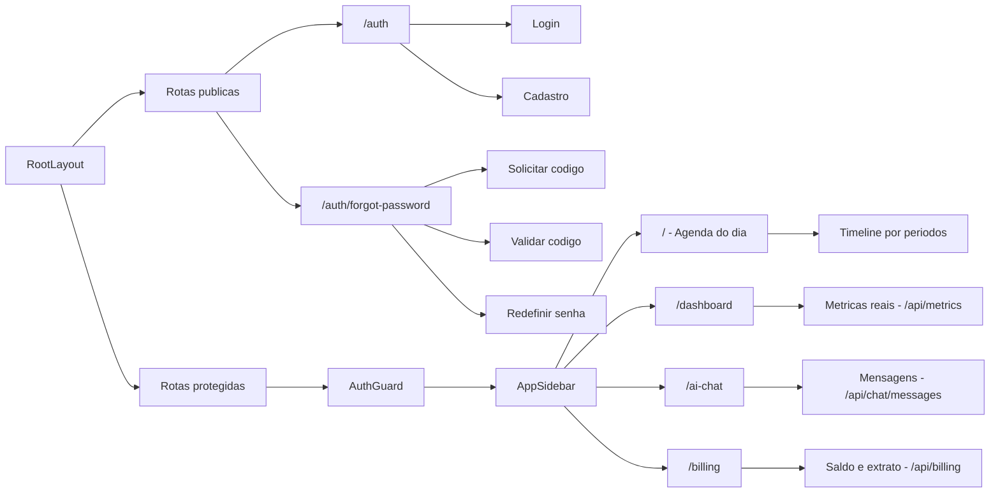
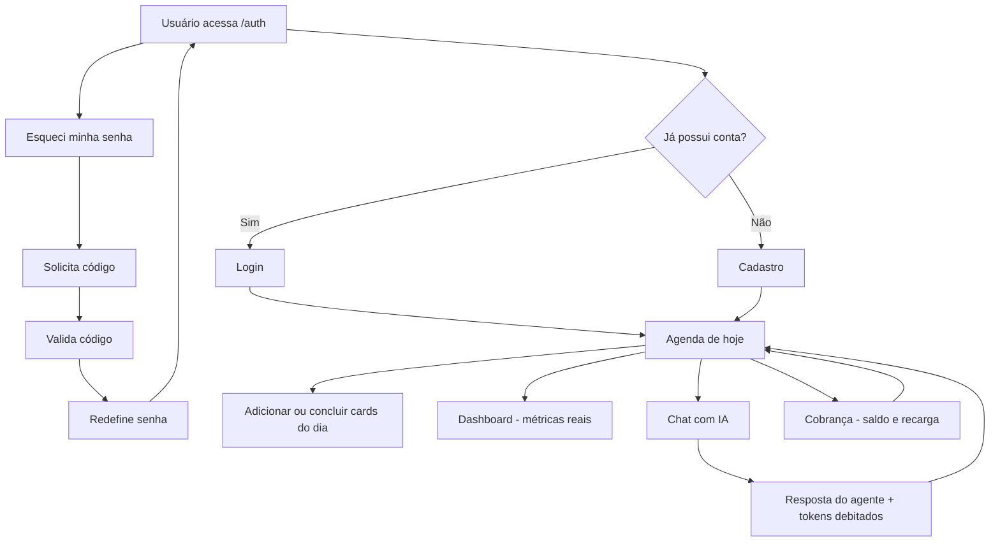
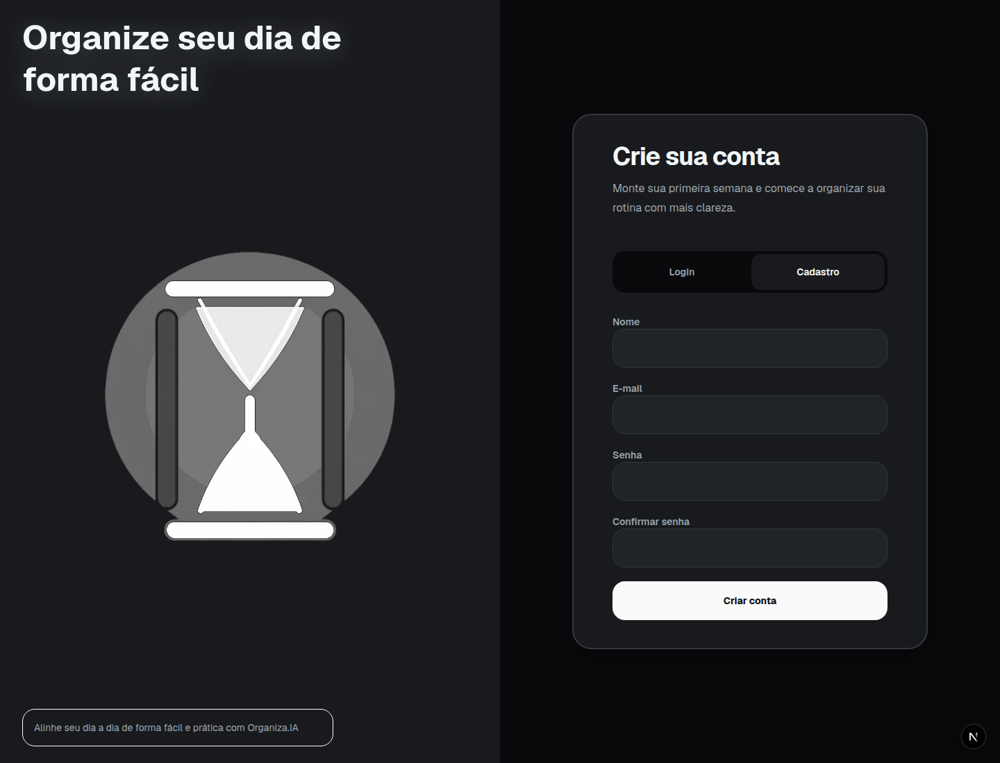
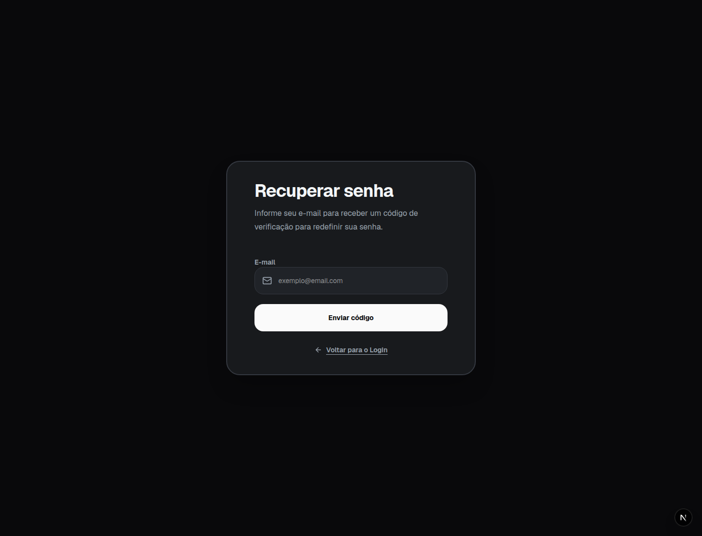

# Organiza.IA — Frontend

Frontend em Next.js do Organiza.IA, assistente de produtividade pessoal movido por IA. É a camada de interface do MVP final: telas de autenticação, recuperação de senha, agenda diária, **chat com agente inteligente**, **dashboard de métricas reais** e **cobrança por tokens**, todas integradas à API FastAPI (Card_14/backend). A base visual veio da Part 1 (Card_12), onde tudo era simulado com MSW + `localStorage`; nesta etapa os dados são reais, vindos do backend.

## Descrição do Projeto

O Organiza.IA é um gerenciador de rotina orientado por inteligência artificial. A proposta não é copiar uma agenda tradicional, que lista tarefas por dia, mês e ano, mas criar uma experiência mais focada: o usuário planeja a semana com apoio da IA e acompanha, na tela principal, apenas o dia atual.

Essa escolha reduz a sobrecarga visual e ajuda o usuário a concentrar energia no que precisa ser feito hoje. A agenda diária funciona como uma timeline dividida por períodos reais do dia (manhã, almoço, tarde, noite), com blocos de atividades. O chat permite conversar com um agente que, além de responder sobre planejamento, **cria e consulta cards da agenda de verdade**. O dashboard traz indicadores de produtividade e uso da IA, e a tela de cobrança mostra o saldo de tokens, o histórico de consumo e a recarga.

## Tema e Propósito

Tema: assistente de produtividade e organização pessoal.

Propósito: ajudar pessoas a planejarem a semana com mais clareza e executarem o dia com menos distração, usando IA como apoio para estruturar rotinas realistas.

## Escopo da Entrega

Esta entrega cobre a interface completa e integrada do MVP:

- Login e cadastro com autenticação real (cookie httpOnly emitido pela API).
- Recuperação de senha em etapas, integrada ao envio real de código por e-mail.
- Agenda diária como tela principal protegida, persistida no backend.
- Chat com IA: envio real de mensagens, histórico persistido, indicador de digitação, contagem de tokens e reação ao saldo esgotado.
- Dashboard com métricas reais (mensagens, tempo ativo, tokens, tarefas, gráficos) vindas de `GET /api/metrics`.
- Cobrança por tokens: saldo atual, histórico de consumo/recargas e recarga simulada.
- Navegação entre telas protegidas por sessão real.

Os dados são servidos pela API FastAPI. O MSW continua no projeto, mas **apenas como recurso opcional de desenvolvimento offline** (ligado por variável de ambiente); por padrão a aplicação fala com a API real.

## Tecnologias Utilizadas

- Next.js 16 com App Router (proxy `/api/*` → API FastAPI via `rewrites`).
- React 19.
- TypeScript.
- Tailwind CSS 4.
- shadcn/ui e Radix UI para componentes base.
- TanStack React Query para busca, cache e invalidação dos dados da API.
- Zustand para o estado global da sessão autenticada.
- Zod para validação de formulários e das respostas da API.
- Recharts para os gráficos do dashboard.
- Sonner para notificações e Lucide React para ícones.
- MSW como mock opcional de desenvolvimento (desligado por padrão).

## Arquitetura Frontend

Organização feature-based: as rotas ficam em `src/app`, cada domínio fica isolado em `src/features` (com `api/`, `schemas/`, `hooks/`, `components/` e um `index.ts` que expõe só o necessário), e o código reutilizável fica em `src/shared`. As páginas de `src/app` só compõem a feature correspondente, mantendo o roteamento separado da interface.

A comunicação com o backend segue um padrão único por feature: um módulo `api/` faz o `fetch`, valida a resposta com Zod (`shared/lib/parse-api-response.ts`) e devolve um resultado tipado `{ok, ...}`; os `hooks/` embrulham isso em React Query. Como o Next faz proxy de `/api/*` para a API, o cookie httpOnly de sessão viaja same-origin, sem CORS no navegador.

### Estrutura Feature-Based

```text
frontend/
  public/
    images/                                # Identidade visual do Organiza.IA
    screenshots/                           # Prints das telas usados neste README

  src/
    app/                                   # Rotas, layouts e entrypoints do Next.js
      auth/                                # Área pública de autenticação
        forgot-password/                   # Fluxo público de recuperação de senha
      (protected)/                         # Grupo de rotas protegidas (agenda, dashboard, chat, cobrança)
        dashboard/
        ai-chat/
        billing/

    features/                              # Funcionalidades isoladas por domínio
      auth/                                # Login, cadastro e sessão (store Zustand + API real)
      forgot-password/                     # Recuperação de senha em etapas
      home/                                # Agenda diária: timeline, cards, hooks e utils de horário
      ai-chat/                             # Chat com IA: envio, histórico, tokens, abort
      dashboard/                           # Métricas reais: api, hooks (React Query), schemas e gráficos
      billing/                             # Saldo, extrato e recarga de tokens
      navigation/                          # Sidebar das rotas protegidas

    mocks/                                 # Infraestrutura do MSW (dev offline opcional)

    shared/                                # Código reutilizável entre features
      components/                          # Componentes compartilhados
        ui/                                # Componentes shadcn/ui
      lib/                                 # cn, parse-api-response e helpers
      providers/                           # QueryProvider (React Query)
      styles/                              # Tokens de cor, tema e estilos globais
```



### Decisões de Organização

`src/app`: define rotas, layouts e páginas do Next.js; as páginas só importam a feature correspondente.

`src/features/auth`: login, cadastro, validações, store Zustand e a API real de autenticação.

`src/features/forgot-password`: o fluxo de recuperação de senha em etapas, separado do login.

`src/features/home`: a agenda diária — timeline, cards, hooks, validações e os utilitários de cálculo de horário/posição.

`src/features/ai-chat`: o chat — envio de mensagens com input bloqueado durante o processamento, histórico real, exibição dos tokens da resposta e botão de abortar.

`src/features/dashboard`: cards e gráficos de produtividade alimentados por `GET /api/metrics` via React Query, com skeleton e estado de erro.

`src/features/billing`: saldo, botões de recarga (renderizados a partir dos pacotes que a API informa) e histórico de consumo/recargas.

`src/features/navigation`: a sidebar das rotas protegidas.

`src/shared`: componentes reutilizáveis, base shadcn/ui, o `QueryProvider`, o helper `parse-api-response` e os estilos globais.

`src/mocks`: inicializa o MSW **apenas** quando `NEXT_PUBLIC_API_MOCKING=enabled` (desenvolvimento offline); por padrão fica desligado e a aplicação usa a API real.

## Telas Desenvolvidas

### Login e Cadastro

Painel visual com a identidade do Organiza.IA e um formulário alternável entre login e cadastro, com validação Zod e feedback visual. A autenticação é real: a API seta um cookie httpOnly de sessão.

### Recuperação de Senha

Solicitação de e-mail, verificação de código, redefinição de senha e tela de sucesso — integrados ao envio real de código (capturado pelo Mailpit em desenvolvimento).

### Agenda do Dia

A tela principal mostra a **rotina diária recorrente** em períodos (manhã, almoço, tarde, noite) — os mesmos blocos valem para todo dia, sem datas específicas. O usuário ajusta o intervalo visível do dia, adiciona cards, marca tarefas como concluídas e remove cards; tudo persistido no backend.

### Chat com IA

Conversa real com o agente: o input fica bloqueado durante o processamento (indicador de digitação + botão de abortar), o histórico é carregado da API ao abrir, cada resposta mostra os tokens consumidos, e quando o saldo esgota o chat exibe um aviso com link para recarregar e desabilita o input. O agente pode criar cards na agenda durante a conversa.

### Dashboard

Métricas reais de produtividade e uso da IA, vindas de `GET /api/metrics`:

- Mensagens trocadas.
- Tempo ativo (tempo de uso da IA).
- Tokens consumidos.
- Tarefas cumpridas.
- Gráfico de consumo semanal de tokens.
- Gráficos de tarefas concluídas/pendentes e interações diárias.

### Cobrança por Tokens

Saldo atual, botões de recarga (pacotes informados pela API) e histórico de débitos/recargas com o saldo resultante de cada movimentação.

## Fluxo do Usuário



## Prints das Telas

### Login


### Cadastro



### Recuperação de Senha



### Agenda do Dia


### Dashboard


### Chat com IA


## Como Executar Localmente

O jeito mais simples de rodar tudo (frontend + API + banco + Mailpit) é pelo Docker Compose na raiz do Card_14 — veja o **README geral do projeto** (um nível acima). O frontend fica em `http://localhost:3000`.

### Rodar só o frontend, sem Docker

Pré-requisito: Node.js 20.9+ (exigido pelo Next.js 16). Com [nvm](https://github.com/nvm-sh/nvm), rode `nvm use` na pasta `frontend`. A API precisa estar acessível (por padrão o proxy aponta para `http://localhost:8001`, configurável por `API_PROXY_URL`).

```bash
cp .env.example .env.local   # ajuste API_PROXY_URL se a API não estiver em localhost:8001
npm install
npm run dev
```

Acesse `http://localhost:3000`. Para entrar, crie uma conta na tela de cadastro e use as credenciais no login.

Para desenvolvimento **offline** (sem backend), suba com `NEXT_PUBLIC_API_MOCKING=enabled` no `.env.local`: o MSW assume os endpoints de auth e agenda com dados no `localStorage` (o chat, o dashboard e a cobrança dependem da API real).

### Scripts

```bash
npm run dev        # ambiente de desenvolvimento (Turbopack)
npm run build      # build de produção
npm run lint       # ESLint
npm run typecheck  # checagem de tipos (tsc --noEmit)
```

## Resultados Obtidos

A entrega integra toda a interface do sistema final à API real: autenticação, agenda, chat com agente inteligente, dashboard de métricas e cobrança por tokens, com dados persistidos no backend e cache/invalidação gerenciados pelo React Query. A arquitetura feature-based mantém cada domínio isolado e as páginas enxutas, e o padrão único de `api/ → schemas Zod → hooks` deixa a comunicação com o backend consistente e tipada de ponta a ponta.
