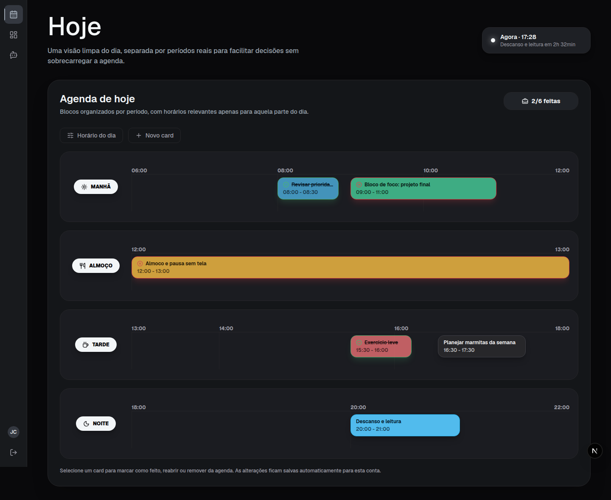

# FastCamp Web — Jornada Full Stack

Repositório com os estudos e projetos que desenvolvi durante o **FastCamp Web**, organizados em 14 cards. Cada etapa contém um relatório técnico e, quando aplicável, o código produzido.

O percurso parte dos fundamentos da Web e avança por frontend, backend, banco de dados, comunicação em tempo real, integração com modelos de linguagem e conceitos de infraestrutura em nuvem. A etapa final consolida esses conhecimentos em um MVP full stack funcional.

## Competências demonstradas

- **Frontend:** TypeScript, React, Next.js, Tailwind CSS, shadcn/ui, React Hook Form, Zod, Zustand, TanStack React Query e Recharts.
- **Backend:** Python, FastAPI, APIs REST, Pydantic, SQLAlchemy, Alembic, autenticação JWT, hash de senhas com Argon2 e testes automatizados com pytest.
- **Dados e integração:** PostgreSQL, consumo de APIs, integração entre frontend e backend e uso de uma API compatível com o padrão OpenAI.
- **Infraestrutura:** Docker, Docker Compose e fundamentos de serviços AWS.
- **Engenharia de software:** componentização, separação de responsabilidades, arquitetura em camadas, organização por funcionalidades, validação de dados, segurança e documentação técnica.

## Conteúdo do FastCamp

| Card | Tema | Evidência produzida |
|---|---|---|
| [01](./Card%201%20-%20V%C3%ADdeo%20e%20Leitura%3A%20Fundamentos%20de%20Web%20(I)/) | Fundamentos da Web | Estudo de redes, DNS, DHCP, TCP/IP, HTTP, HTML, CSS, JavaScript, JSON e APIs. |
| [02](./Card%202%20-%20Leitura%3A%20Arquitetura%20e%20Boas%20Pr%C3%A1ticas%20(I)/) | Arquitetura e boas práticas | Separação de responsabilidades, modularidade, MVC, arquitetura em camadas, monorepo e multirepo. |
| [03](./Card%203%20-%20Pr%C3%A1tica%3A%20Iniciando%20com%20TypeScript%20(II)/) | TypeScript | Exercícios sobre tipos, funções, objetos, classes, interfaces e generics. |
| [04](./Card_4-Fundamentos_do_React_com_TypeScript_e_Next.js/) | React, TypeScript e Next.js | Aplicação de biblioteca pessoal com componentes reutilizáveis, rotas, armazenamento local e consumo da Google Books API. |
| [05](./Card_5-Formularios_e_UX_para_Dashboards/) | Formulários e dashboards | Interface com autenticação simulada, React Hook Form, Zod, shadcn/ui, gráficos e consumo da API do IBGE. |
| [06](./Card_6_Pratica_FastAPI/) | FastAPI | API CRUD em Python, schemas, códigos HTTP e testes automatizados independentes. |
| [07](./Card_7_-Integracao_com_Banco_de_Dados_usando_FastAPI/) | Banco de dados com FastAPI | Integração full stack com SQLAlchemy, Alembic, autenticação JWT, Argon2 e Docker Compose. |
| [08](./Card_8%20-%20V%C3%ADdeo%20e%20Leitura%3A%20WebSocket%20para%20Dashboards/) | WebSockets | Estudo de conexões bidirecionais, autenticação, ciclo de vida e cenários de uso com FastAPI. |
| [09](./Card_9%20-%20V%C3%ADdeo%20e%20Leitura%3A%20Integra%C3%A7%C3%A3o%20com%20LLM%20usando%20FastAPI/) | LLM com FastAPI | Estudo de integração segura no backend, controle de acesso, limites de uso e proteção de chaves. |
| [10](./Card_10%20-%20V%C3%ADdeo%3A%20Infraestrutura%20com%20AWS%20Part%201/) | AWS — parte 1 | Fundamentos de S3, EC2, ECS, Fargate, Lambda e API Gateway. |
| [11](./Card_11%20-%20V%C3%ADdeo%20e%20Leitura%3A%20Infraestrutura%20com%20AWS%20Part%202/) | AWS — parte 2 | Fundamentos de Step Functions, RDS, DynamoDB, SQS, CloudWatch e CloudFront. |
| [12](./Card_12-Pratica_Projeto_Final-Part1/) | Projeto final — frontend | Planejamento e construção da interface do Organiza.IA com arquitetura feature-based e APIs simuladas pelo MSW. |
| [13](./Card_13-Pratica_Projeto-Final-Part2/) | Projeto final — backend | API, PostgreSQL, autenticação, recuperação de senha, agenda, migrações, testes e ambiente Docker. |
| [14](./Card_14-Pratica_Projeto-Final-Part-Final/) | Projeto final — integração | Integração completa do Organiza.IA, agente com IA, métricas, cobrança por tokens e documentação de execução. |

## Projeto final: Organiza.IA

O **Organiza.IA** é um assistente de produtividade pessoal. Além de responder pelo chat, o agente de IA utiliza ferramentas controladas pelo backend para consultar, criar, editar e remover atividades da agenda do usuário.

O MVP inclui:

- cadastro, login, sessão protegida e recuperação de senha;
- agenda diária em formato de timeline;
- agente de IA com histórico persistente e uso de ferramentas;
- dashboard com métricas individuais;
- saldo, consumo e recarga simulada de tokens;
- API documentada automaticamente pelo Swagger;
- ambiente completo com frontend, backend, PostgreSQL e Mailpit via Docker Compose;
- suíte de testes automatizados para as principais regras do backend.

Para arquitetura, instruções de execução, testes, segurança e demais telas, consulte a [documentação completa do Organiza.IA](./Card_14-Pratica_Projeto-Final-Part-Final/README.md).

## Organização do repositório

Cada pasta representa um card do FastCamp e pode conter:

- **relatório em PDF**, com conceitos estudados, decisões, dificuldades e conclusões;
- **códigos de aula**, produzidos durante o acompanhamento do conteúdo;
- **código pessoal**, usado para aplicar e expandir o que foi estudado;
- **documentação específica**, quando a etapa possui uma aplicação executável.
